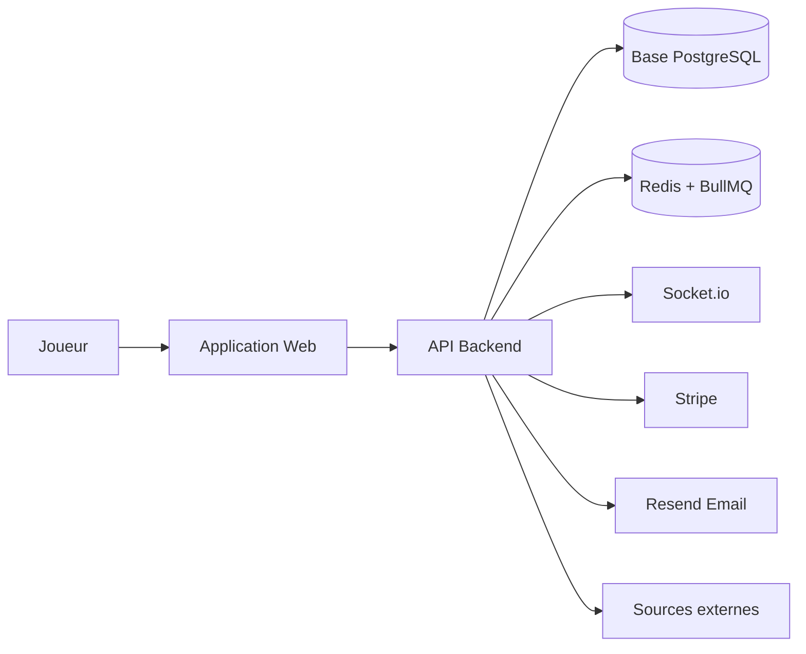
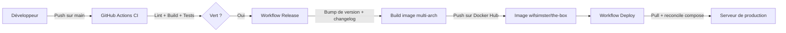

# The Box

Plateforme de jeu où les joueurs identifient des jeux vidéo à partir de captures d'écran. Défis quotidiens, classements en direct, mode géo-localisation, abonnements et tournois — pensé pour une communauté gaming engagée.

## Table des matières

- [À quoi sert ce produit ?](#à-quoi-sert-ce-produit-)
- [Fonctionnalités principales](#fonctionnalités-principales)
- [Comment ça fonctionne](#comment-ça-fonctionne)
- [Environnements](#environnements)
- [Déploiement](#déploiement)
- [Stack technique](#stack-technique)
- [Documentation complémentaire](#documentation-complémentaire)

### Documentation technique

| Document | Description |
|----------|-------------|
| [Architecture](docs/architecture.md) | Vue d'ensemble du monorepo et de l'architecture en couches du backend |
| [Référence API](docs/api.md) | Endpoints REST exposés sous `/api/` (jeu, classement, utilisateur, admin) |
| [Authentification](docs/authentication.md) | Flux d'inscription, connexion et gestion de session via Better Auth |
| [Mise en place Better Auth](docs/better-auth-setup.md) | Étapes de configuration et de migration vers Better Auth |
| [Schéma de base de données](docs/database.md) | Modèle de données PostgreSQL et relations entre entités |
| [Mécanique de jeu](docs/game-flow.md) | Phases d'une partie, calcul des scores et système d'indices |
| [Mode Géo](docs/geo-mode.md) | Localisation sur carte, contribution crowdsourcée et pipeline d'ingestion |
| [Abonnements Stripe](docs/billing-stripe.md) | Catalogue d'offres, flux Checkout et webhooks de facturation |
| [Événements temps réel](docs/realtime.md) | Événements Socket.io pour les classements en direct |
| [Tokens UI](docs/ui-tokens.md) | Contrat des tokens de design (couleurs, ombres, rayons, typographie) |
| [Design System Oxygen](docs/oxygen-design-system.md) | Principes Oxygen appliqués à The Box (accessibilité, hiérarchie d'actions) |

## À quoi sert ce produit ?

- Tester votre culture jeu vidéo en identifiant des captures d'écran
- Relever un défi quotidien avec une difficulté progressive
- Vous comparer aux autres joueurs grâce à des classements en direct
- Localiser des scènes de jeu sur une carte avec le mode Géo
- Soutenir le projet via un abonnement et débloquer des avantages premium

## Fonctionnalités principales

- **Défi quotidien** — Une nouvelle série de captures à identifier chaque jour, avec une difficulté qui grimpe (Facile → Difficile)
- **Mode rattrapage** — Rejouez les défis manqués des 7 derniers jours (hors classement)
- **Mode Géo** — Localisez la scène d'un jeu sur une carte interactive (Elden Ring, etc.)
- **Indices et bonus** — Révélez l'année de sortie, le studio ou l'éditeur, ou prolongez le chronomètre
- **Classements en direct** — Tableaux du jour et du mois mis à jour en temps réel via WebSocket
- **Tournois** — Compétitions ponctuelles entre joueurs
- **Récompenses de connexion** — Calendrier de connexions quotidiennes et bonus de série
- **Succès** — Trophées débloquables, du débutant à l'expert
- **Profils publics** — Statistiques, historique de parties, succès affichés
- **Parrainage** — Inviter des amis et profiter d'avantages communs
- **Abonnement** — Gestion des abonnements payants (Stripe) avec offres à vie
- **Espace administration** — Gestion des jeux, utilisateurs, défis, files de tâches et journal d'audit
- **Internationalisation** — Français par défaut, anglais disponible

## Comment ça fonctionne

Le joueur utilise l'application web qui consomme l'API backend. L'API stocke les données dans PostgreSQL et délègue les tâches longues (imports de jeux, génération du défi quotidien, e-mails) à une file Redis pilotée par BullMQ. Les classements sont diffusés en temps réel par Socket.io. Les paiements passent par Stripe, les e-mails transactionnels par Resend, et les imports de captures par des sources externes (RAWG, Steam, etc.).

## Environnements

| Environnement | URL | Description |
|---------------|-----|-------------|
| Développement | `http://localhost:5173` | Frontend Vite (dev local) |
| Développement (API) | `http://localhost:3000` | Backend Express (dev local) |
| Production | `https://the-box.battistella.ovh` | Image Docker unique sur le port 80 |

## Déploiement

Le pipeline d'Intégration Continue (CI) lance les contrôles de qualité à chaque push. Le workflow Release est déclenché manuellement, calcule la nouvelle version, génère le changelog, construit une image multi-architecture (amd64, arm64) et la publie sur Docker Hub. Le workflow Deploy s'exécute ensuite sur un runner auto-hébergé pour récupérer la nouvelle image et reconcilier la pile docker-compose en production.

## Stack technique

- **Frontend :** React 19, Vite 7, TypeScript, TailwindCSS 4, Zustand, react-router 7, i18next, Framer Motion, Radix UI / shadcn
- **Backend :** Node.js 24, Express 5, Better Auth, Socket.io 4, BullMQ, Pino (architecture en couches)
- **Base de données :** PostgreSQL 16 (Knex.js + Kysely)
- **File de tâches :** Redis + BullMQ (workers d'import, défi quotidien, e-mails, pipeline géo)
- **Paiement & e-mail :** Stripe (abonnements), Resend (e-mails transactionnels)
- **Tests :** Playwright (E2E)
- **Infrastructure :** Docker multi-stage, GitHub Actions, Docker Hub, runner auto-hébergé

## Documentation complémentaire

L'ensemble de la documentation technique se trouve dans le dossier [`docs/`](./docs/). Voir le tableau de la section [Documentation technique](#documentation-technique) ci-dessus.

Les directives spécifiques aux assistants IA sont dans [`CLAUDE.md`](./CLAUDE.md) (Claude Code) et [`AGENT.md`](./AGENT.md) (agents autonomes).
