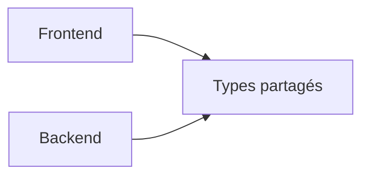
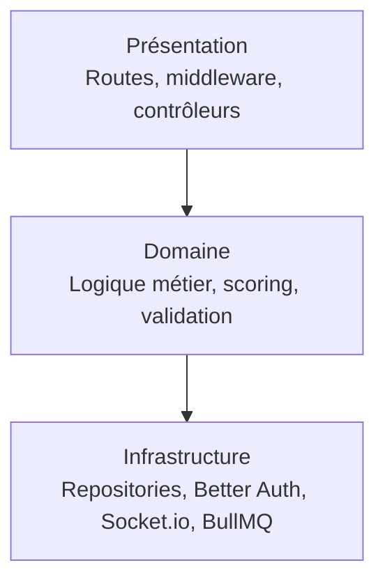
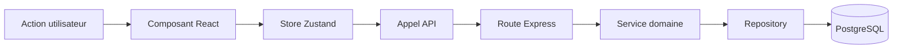
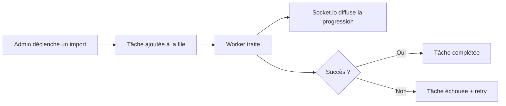

# Architecture

Vue d'ensemble de l'organisation en monorepo et de l'architecture en couches du backend. Destiné aux développeurs et architectes qui interviennent sur le code.

## Structure du monorepo

Le projet utilise les workspaces npm pour gérer trois packages :

| Package | Rôle |
|---------|------|
| `@the-box/types` | Types TypeScript partagés entre frontend et backend |
| `@the-box/backend` | API Express, workers BullMQ, serveur Socket.io |
| `@the-box/frontend` | Application React (SPA) |



> **Détail technique.** Toujours rebuilder `@the-box/types` après modification (`npm run build:types`) avant que les autres packages ne consomment les changements.

## Architecture backend en couches

Le backend suit une architecture pragmatique en trois couches, avec une dépendance unidirectionnelle.



La couche `domain` ne dépend jamais de l'infrastructure. Elle exprime des règles métier pures et reste testable en isolation.

### Couche présentation (`src/presentation/`)

- Définit les endpoints HTTP et délègue au domaine
- Middleware : authentification, validation Zod, journalisation des requêtes
- Les contrôleurs restent fins : ils ne contiennent jamais de logique métier

### Couche domaine (`src/domain/services/`)

Services principaux :

| Service | Responsabilité |
|---------|----------------|
| `game.service.ts` | Gestion des défis et des captures d'écran |
| `user.service.ts` | Profils et historique de parties |
| `leaderboard.service.ts` | Classements et calcul des centiles |
| `auth.service.ts` | Logique d'authentification |
| `fuzzy-match.service.ts` | Matching tolérant pour les noms de jeux |
| `achievement.service.ts` | Évaluation et déblocage des succès |
| `daily-login.service.ts` | Logique de série de connexions quotidiennes |
| `billing.service.ts` | Abonnements et facturation Stripe |
| `referral.service.ts` | Programme de parrainage |
| `geo-*.service.ts` | Mode Géo (consensus, scoring, métadonnées, récompenses) |
| `admin.service.ts` | Opérations administratives |
| `job.service.ts` | Gestion des tâches en arrière-plan |

### Couche infrastructure (`src/infrastructure/`)

```text
infrastructure/
├── auth/              # Better Auth
├── database/          # Connexion PostgreSQL (Knex + Kysely)
├── logger/            # Pino structuré
├── queue/             # BullMQ + Redis
│   ├── connection.ts
│   ├── queues.ts
│   └── workers/       # Workers d'imports, défi quotidien, géo, e-mails
├── repositories/      # Couche d'accès aux données
└── socket/            # Serveur Socket.io
```

## Architecture frontend

Le frontend suit une organisation par fonctionnalité.

```text
src/
├── components/
│   ├── ui/            # Primitives shadcn/Radix (Button, Card, etc.)
│   ├── game/          # Composants de jeu (viewer, hints, input, results)
│   ├── achievement/   # Cards, grille, notifications de succès
│   ├── daily-login/   # Modal de récompense, calendrier
│   ├── admin/         # Panneaux d'administration
│   └── layout/        # Header, Footer, PageHero
├── pages/             # Pages routées (Home, Game, Leaderboard, Geo, Profile…)
├── stores/            # Zustand (auth, game, achievement, dailyLogin, admin)
├── services/          # Logique côté client (scoring, recherche, soumission)
├── hooks/             # Hooks personnalisés (useAuth, useGameGuess, etc.)
└── lib/               # Utilitaires, client API, configuration i18n
```

### Gestion d'état (Zustand)

Stores principaux avec persistance :

- `authStore` : utilisateur courant et session
- `gameStore` : session de jeu, chronomètre, scores
- `achievementStore` : succès et notifications
- `dailyLoginStore` : récompenses de connexion
- `adminStore` : état de l'espace administration

## Flux de données



## Système de tâches en arrière-plan

L'application s'appuie sur BullMQ et Redis pour les traitements asynchrones.

| Type de tâche | Description | Fréquence |
|---------------|-------------|-----------|
| `import-games` | Importer des jeux depuis RAWG | À la demande |
| `import-screenshots` | Récupérer des captures pour les jeux | À la demande |
| `create-daily-challenge` | Générer le défi quotidien | Tous les jours à 00:00 UTC |
| `sync-all-games` | Synchroniser les données RAWG | Hebdomadaire (dim. 02:00 UTC) |
| `geo-*-import` | Importer des données géo (Wikidata, Steam, Fandom, etc.) | À la demande |
| `streak-risk-email` | Envoyer un rappel aux joueurs en risque de perdre leur série | Programmé |
| `referral-announcement-email` | Annonce d'arrivée d'un filleul | Sur événement |



## Intégrations externes

| Service | Usage |
|---------|-------|
| RAWG | Catalogue de jeux et captures |
| Steam | Captures de jeux Steam |
| Wikidata, Fandom, StrategyWiki, Wand, Fextralife | Données pour le mode Géo |
| Stripe | Abonnements et paiements |
| Resend | E-mails transactionnels (réinitialisation de mot de passe, rappels) |
| Better Auth | Authentification (sessions, e-mail/mot de passe) |

## Décisions structurantes

1. **Package de types unique** — source de vérité pour toutes les interfaces TypeScript partagées
2. **Pattern repository** — abstraction de l'accès base de données
3. **Couche services** — règles métier centralisées et testables en isolation
4. **Contrôleurs fins** — les routes ne traitent que la couche HTTP
5. **Zustand plutôt que Redux** — API plus simple, moins de boilerplate
6. **BullMQ + Redis** — file de tâches fiable avec mécanisme de retry
7. **Fuzzy matching** — tolérance sur les noms de jeux pour une meilleure expérience joueur
8. **Image Docker unique** — Node sert le frontend buildé et l'API sur le port 80 en production
