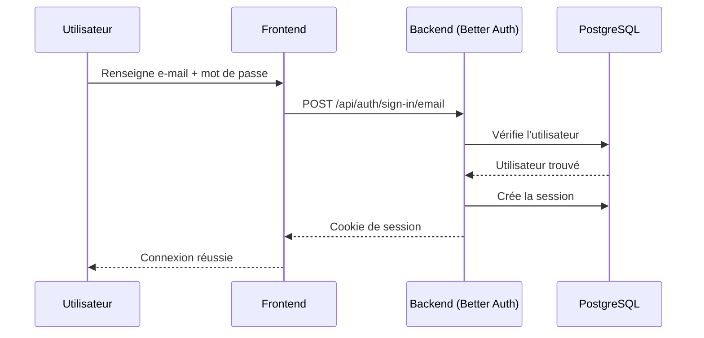

# Authentification

The Box utilise [Better Auth](https://better-auth.com) pour l'inscription, la connexion et la gestion de session par e-mail/mot de passe. Document destiné aux développeurs qui ajoutent ou modifient des flux d'authentification.

## Vue d'ensemble du flux



Better Auth gère automatiquement la persistance des sessions, le hash des mots de passe et la création des tables nécessaires.

## Configuration

### Backend

Le client Better Auth est configuré dans `packages/backend/src/infrastructure/auth/auth.ts` :

```typescript
export const auth = betterAuth({
  database: new Pool({ connectionString: env.DATABASE_URL }),
  emailAndPassword: { enabled: true },
  session: {
    expiresIn: 60 * 60 * 24 * 7, // 7 jours
    updateAge: 60 * 60 * 24,     // 1 jour
  },
})
```

### Frontend

Le client React est exposé dans `packages/frontend/src/lib/auth-client.ts` :

```typescript
import { createAuthClient } from 'better-auth/react'

export const authClient = createAuthClient({
  baseURL: import.meta.env.VITE_API_URL,
})

export const { signIn, signUp, signOut, useSession } = authClient
```

## Variables d'environnement

| Variable | Rôle |
|----------|------|
| `BETTER_AUTH_SECRET` | Clé secrète (≥ 32 caractères) — `openssl rand -base64 32` |
| `API_URL` | URL publique de l'API (callbacks Better Auth) |
| `CORS_ORIGIN` | URL du frontend autorisée à appeler l'API |
| `RESEND_API_KEY` | Clé Resend pour les e-mails (optionnel en dev) |
| `EMAIL_FROM` | Adresse d'envoi des e-mails transactionnels |

## Double authentification

Depuis la migration `20260520_twofactor_passkey.ts`, l'app expose deux seconds facteurs branchés via Better Auth :

- **TOTP** (plugin `twoFactor`) — code à 6 chiffres généré par une app type Google Authenticator, 1Password, Authy. 10 codes de secours générés à l'activation, à usage unique.
- **Passkey / WebAuthn** (plugin `@better-auth/passkey`) — empreinte digitale, Face ID, Windows Hello, clés FIDO2. L'utilisateur peut enregistrer plusieurs passkeys (recommandé : un appareil mobile + un poste de travail).

Les deux facteurs sont **opt-in côté joueurs**, gérés depuis la page `/settings/security`. Le rollout admin-forcé est tracké séparément (voir `tasks/2fa-webauthn-subagents-meeting.html`, décision n°2).

### Endpoints exposés par les plugins

| Méthode | Endpoint | Usage |
|---------|----------|-------|
| POST | `/api/auth/two-factor/enable` | Démarre l'enrôlement (renvoie `totpURI` + `backupCodes`) |
| POST | `/api/auth/two-factor/disable` | Désactive la 2FA |
| POST | `/api/auth/two-factor/verify-totp` | Vérifie le code TOTP (en login ou à l'activation) |
| POST | `/api/auth/two-factor/verify-backup-code` | Vérifie un code de secours |
| POST | `/api/auth/two-factor/generate-backup-codes` | Régénère 10 nouveaux codes |
| POST | `/api/auth/passkey/register` | Enregistre une nouvelle passkey |
| POST | `/api/auth/passkey/authenticate` | Connexion via passkey |
| POST | `/api/auth/passkey/delete-passkey` | Supprime une passkey |
| POST | `/api/auth/passkey/update-passkey` | Renomme une passkey |

### Configuration `rpID` et `origin`

Le plugin `passkey` lie chaque credential à l'origine **exacte** au moment de l'enregistrement. Changer `API_URL` ou `CORS_ORIGIN` en production **invalide toutes les passkeys existantes**.

| Env | `API_URL` | `rpID` calculé | Origine WebAuthn |
|-----|-----------|----------------|------------------|
| dev | `http://localhost:3000` | `localhost` | `http://localhost:5173` |
| prod | `https://thebox.example.com` | `thebox.example.com` | `https://thebox.example.com` |

`rpID = new URL(env.API_URL).hostname` est résolu une seule fois au boot. Geler ces variables avant le rollout 2FA.

### Comptes anonymes

Les comptes anonymes (`isAnonymous: true`) n'ont pas accès à `/settings/security` côté frontend. Les boutons d'activation 2FA et d'ajout de passkey sont désactivés.

## Endpoints fournis par Better Auth

> **Détail technique.** Better Auth expose automatiquement ces endpoints sous `/api/auth/*`. Aucune route Express à écrire.

| Méthode | Endpoint | Description |
|---------|----------|-------------|
| POST | `/api/auth/sign-up/email` | Inscription par e-mail/mot de passe |
| POST | `/api/auth/sign-in/email` | Connexion par e-mail |
| POST | `/api/auth/sign-in/username` | Connexion par nom d'utilisateur |
| POST | `/api/auth/sign-in/anonymous` | Connexion invité |
| POST | `/api/auth/sign-out` | Déconnexion |
| GET | `/api/auth/session` | Récupère la session courante |
| POST | `/api/auth/forget-password` | Demande de réinitialisation |
| POST | `/api/auth/reset-password` | Validation de la réinitialisation |

## Utilisation côté frontend

### Inscription

```typescript
import { signUp } from '@/lib/auth-client'

const { data, error } = await signUp.email({ email, password, name })
if (error) return console.error(error.message)
// L'utilisateur est connecté
```

### Connexion

```typescript
import { signIn } from '@/lib/auth-client'

const { data, error } = await signIn.email({ email, password })
if (error) return console.error(error.message)
navigate('/play')
```

### Hook de session

```typescript
import { useSession } from '@/lib/auth-client'

function Header() {
  const { data: session, isPending } = useSession()
  if (isPending) return <Spinner />
  return session ? <UserMenu user={session.user} /> : <LoginButton />
}
```

### Déconnexion

```typescript
await signOut()
navigate('/')
```

## Routes protégées

### Backend — middleware

```typescript
import { auth } from '../infrastructure/auth/auth.js'

export async function authMiddleware(req, res, next) {
  const session = await auth.api.getSession({ headers: req.headers })
  if (!session) {
    return res.status(401).json({
      success: false,
      error: { code: 'UNAUTHORIZED', message: 'Authentication required' },
    })
  }
  req.userId = session.user.id
  next()
}
```

### Frontend — composant de garde

```typescript
function ProtectedRoute({ children }) {
  const { data: session, isPending } = useSession()
  if (isPending) return <LoadingScreen />
  if (!session) return <Navigate to="/login" />
  return children
}
```

## Mode invité

Better Auth supporte la connexion anonyme via `signIn.anonymous()`. Une session temporaire est créée et liée à un utilisateur sans e-mail.

## Tables créées par Better Auth

> **Détail technique.** Better Auth crée et maintient ces tables automatiquement au premier `migrate`.

| Table | Contenu |
|-------|---------|
| `user` | Comptes utilisateurs |
| `session` | Sessions actives |
| `account` | Comptes OAuth ou e-mail/mot de passe |
| `verification` | Jetons de vérification d'e-mail |

## Premier admin

Au premier enregistrement, l'utilisateur reçoit automatiquement le rôle `admin`. Voir `auth.service.ts` pour la logique exacte.

## Pour aller plus loin

- [Mise en place Better Auth](./better-auth-setup.md) — étapes de configuration et d'intégration initiale
- [Référence API](./api.md) — autres endpoints (jeu, classement, utilisateur)
