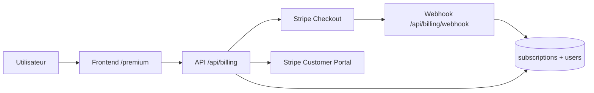
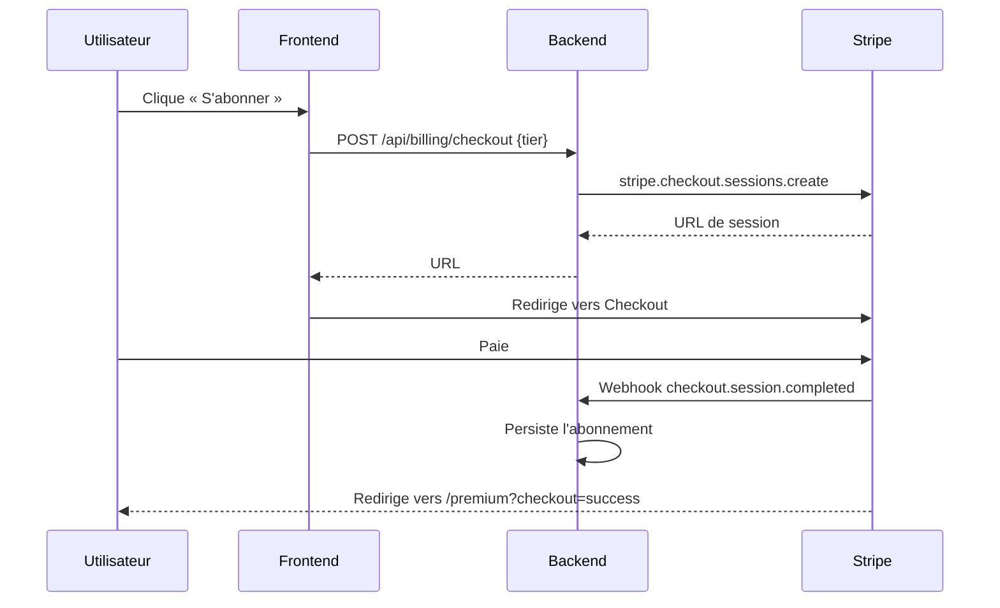
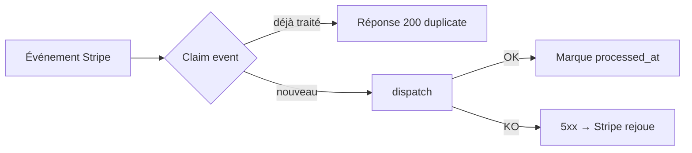
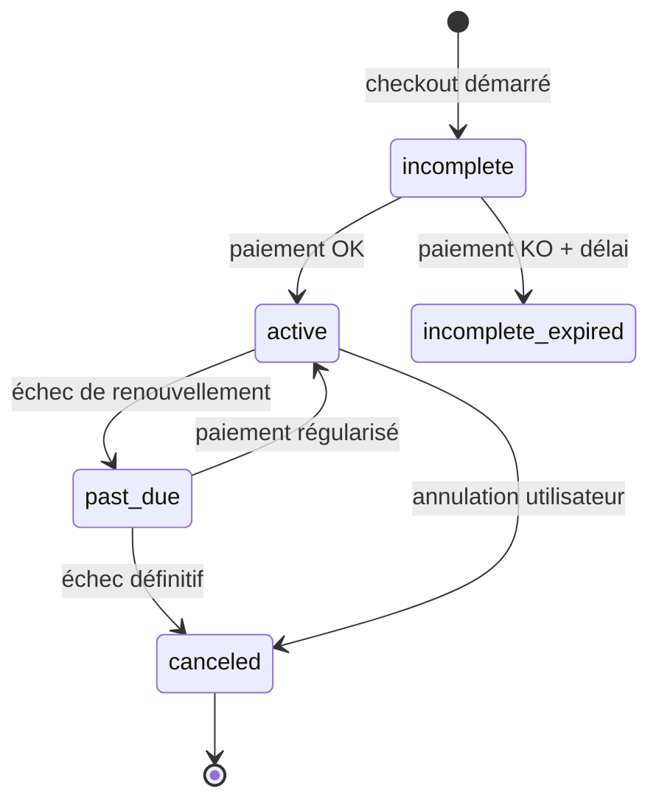

# Abonnements et facturation (Stripe)

The Box propose un abonnement premium et un statut « supporter à vie » via Stripe. Document destiné aux Product Owners et développeurs qui interviennent sur la facturation.

## Vue d'ensemble



Le frontend appelle l'API pour démarrer un Checkout ou ouvrir le portail client. Stripe notifie le backend par webhook (signé) à chaque événement (paiement, renouvellement, annulation). L'état d'abonnement est stocké en local dans `subscriptions` et lu par chaque endpoint protégé.

## Catalogue des offres

> **Détail technique.** Source de vérité dans `packages/backend/src/config/billing.ts`. Le résolveur récupère les `priceId` Stripe au runtime via `stripe.prices.list({ lookup_keys })` — pas de `priceId` codé en dur dans l'environnement.

| Tier | `lookup_key` | Montant (EUR) | Période |
|------|--------------|---------------|---------|
| `premium_monthly` | `the_box_premium_monthly` | 3,99 € | Mensuel |
| `premium_annual` | `the_box_premium_annual` | 29,99 € | Annuel |
| `supporter_lifetime` | (paiement unique) | À configurer | Lifetime |

Le script `npm run stripe:check` (depuis `packages/backend`) vérifie en CI que chaque entrée du catalogue correspond bien au prix Stripe (montant, devise, intervalle).

### Hiérarchie des droits (entitlement)

> **Détail technique.** `domain/services/billing.service.ts` — fonction `getEntitlement(userId)`.

Ordre de résolution :

1. **`supporter_lifetime`** — gagne sur tout. Un utilisateur qui a payé à vie reste premium même s'il annule un abonnement récurrent ultérieur.
2. **Abonnement actif** (`active`, `trialing`, `past_due`, etc.) — donne accès premium tant que le statut Stripe est dans `ENTITLED_STATUSES`.
3. **Sinon** — utilisateur gratuit.

Un retour par défaut « gratuit » est utilisé en cas d'erreur ou de configuration manquante : un Stripe mal configuré ne peut **jamais** silencieusement accorder le premium.

## Flux d'achat (Checkout)



## Endpoints API

### `/api/billing` (joueur)

| Méthode | Endpoint | Auth | Description |
|---------|----------|------|-------------|
| GET | `/prices` | — | Liste publique des offres (cache 5 min) |
| GET | `/me` | Oui | Entitlement courant (`isPremium`, `tier`, `validUntil`, `cancelAtPeriodEnd`) |
| POST | `/checkout` | Oui | Crée une session Stripe Checkout pour un tier |
| POST | `/portal` | Oui | Crée une session du portail client Stripe (gérer/annuler) |

#### Exemple — démarrer un checkout

```http
POST /api/billing/checkout
Authorization: Bearer <token>
Content-Type: application/json

{ "tier": "premium_annual" }
```

Réponse :

```json
{ "success": true, "data": { "url": "https://checkout.stripe.com/..." } }
```

#### Codes d'erreur spécifiques

| Code | HTTP | Cause |
|------|------|-------|
| `BILLING_NOT_CONFIGURED` | 503 | `STRIPE_SECRET_KEY` manquant |
| `PRICE_NOT_CONFIGURED` | 500 | `lookup_key` introuvable côté Stripe |
| `EMAIL_REQUIRED` | 400 | Utilisateur anonyme sans e-mail réel |

### `/api/billing/webhook` (Stripe vers backend)

> **Détail technique.** Monté **avant** `express.json()` dans `index.ts` car Stripe vérifie la signature sur les bytes bruts. Parser `express.raw({ type: 'application/json' })` scoped sur cette route.

#### Vérification de signature

`STRIPE_WEBHOOK_SECRET` accepte plusieurs secrets séparés par virgule pour permettre une rotation sans interruption :

```
STRIPE_WEBHOOK_SECRET=whsec_old,whsec_new
```

Chaque secret est essayé jusqu'à validation réussie.

#### Idempotence à deux phases



Table `stripe_event_processed` :

1. **Phase claim** — réserve l'événement. Un retry concurrent voit l'enregistrement et passe.
2. **Phase mark** — `processed_at` n'est positionné qu'après dispatch réussi. Un échec laisse `processed_at` NULL → Stripe peut rejouer.

#### Événements traités

| Événement | Effet |
|-----------|-------|
| `checkout.session.completed` | Persiste l'abonnement OU marque l'utilisateur `supporter_lifetime` si `metadata.tier === 'supporter_lifetime'` |
| `customer.subscription.created` | Crée l'enregistrement local |
| `customer.subscription.updated` | Met à jour le statut, la date de fin, `cancel_at_period_end` |
| `customer.subscription.deleted` | Marque l'abonnement comme terminé |
| `invoice.payment_failed` | Trace l'échec de paiement |
| `customer.deleted` | Nettoie le lien `stripe_customer_id` |
| `charge.refunded` / `charge.dispute.created` | Trace pour suivi manuel |

## Variables d'environnement

| Variable | Rôle |
|----------|------|
| `STRIPE_SECRET_KEY` | Clé secrète Stripe (`sk_test_…` en dev, `sk_live_…` en prod) |
| `STRIPE_WEBHOOK_SECRET` | Secret(s) de signature webhook (séparés par virgule pour rotation) |
| `STRIPE_CHECKOUT_SUCCESS_URL` | URL de retour après paiement réussi |
| `STRIPE_CHECKOUT_CANCEL_URL` | URL de retour après annulation |
| `STRIPE_PORTAL_RETURN_URL` | URL de retour depuis le portail client |

> **À noter.** Si `STRIPE_SECRET_KEY` n'est pas défini, l'API renvoie `503 BILLING_NOT_CONFIGURED` sur `/checkout` et `/portal`. Le reste de l'application reste fonctionnel.

## Tables principales

| Table | Contenu |
|-------|---------|
| `subscriptions` | Abonnements actifs (`stripe_customer_id`, `stripe_subscription_id`, `stripe_price_id`, `status`, `current_period_end`, `cancel_at_period_end`) |
| `stripe_event_processed` | Idempotence des webhooks (`event_id`, `event_type`, `processed_at`) |
| `users.stripe_customer_id` | Lien vers le Customer Stripe (créé paresseusement au premier checkout) |
| `users.supporter_lifetime_at` | Date d'achat du statut « supporter à vie » |

## Cycle de vie d'un abonnement



Statuts considérés comme « entitled » (premium actif) : `active`, `trialing`, `past_due` (grâce). Les autres (`canceled`, `incomplete_expired`, `unpaid`, `paused`) coupent l'accès premium.

## Vérification du catalogue

```bash
npm run stripe:check    # depuis packages/backend
```

Le script :

1. Récupère chaque prix Stripe par `lookup_key`
2. Vérifie que `unit_amount`, `currency`, `interval` correspondent au catalogue local
3. Échoue la CI si un écart est détecté

> **Bonne pratique.** Pour changer un prix : créer un nouveau prix Stripe avec le même `lookup_key` et `transfer_lookup_key=true`. Aucune modification d'environnement ni de déploiement requis.

## Bonnes pratiques

- **Création paresseuse du Customer Stripe.** Les utilisateurs gratuits n'ont pas de Customer ; il est créé au premier checkout, avec `metadata.userId`.
- **Pas de premium pour les anonymes.** L'inscription anonyme Better Auth est rejetée au checkout (`EMAIL_REQUIRED`) — sinon un abonnement payé serait irrécupérable.
- **Webhooks idempotents.** Toujours retourner 200 si l'événement est déjà traité. Renvoyer 5xx en cas d'erreur transitoire pour que Stripe rejoue.
- **Ne jamais coder un `priceId` en dur.** Toujours passer par `lookup_key` + le résolveur.
