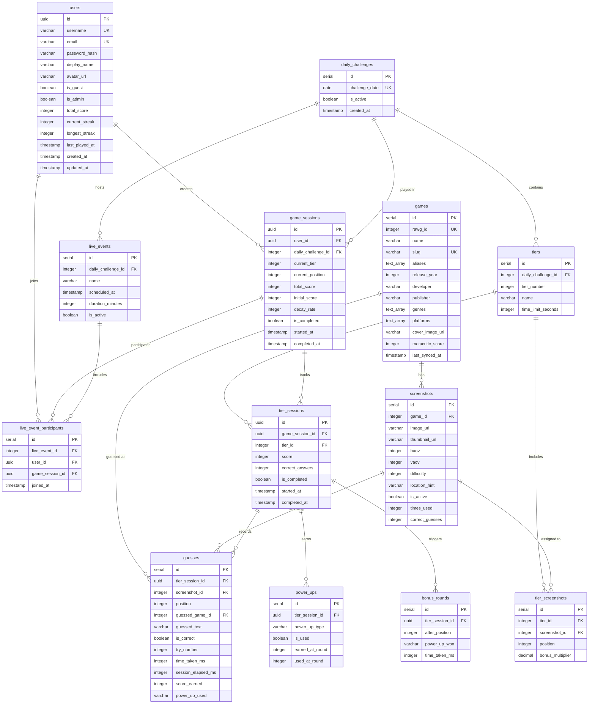

# Database Schema

The Box uses PostgreSQL with Knex.js for database access and migrations.

## Entity Relationship Diagram



## Tables

### users

Player accounts and statistics.

| Column | Type | Description |
| ------ | ---- | ----------- |
| id | UUID | Primary key |
| username | VARCHAR(50) | Unique username |
| email | VARCHAR(255) | Unique email |
| password_hash | VARCHAR(255) | Bcrypt hash |
| display_name | VARCHAR(100) | Display name |
| avatar_url | VARCHAR(500) | Avatar image URL |
| is_guest | BOOLEAN | Guest account flag |
| is_admin | BOOLEAN | Admin privileges |
| total_score | INTEGER | Lifetime score |
| current_streak | INTEGER | Current daily streak |
| longest_streak | INTEGER | Best streak |
| last_played_at | TIMESTAMP | Last game played |
| created_at | TIMESTAMP | Account creation |
| updated_at | TIMESTAMP | Last update |

### games

Video game catalog with RAWG integration.

| Column | Type | Description |
| ------ | ---- | ----------- |
| id | SERIAL | Primary key |
| rawg_id | INTEGER | Unique RAWG database ID |
| name | VARCHAR(255) | Game title |
| slug | VARCHAR(255) | URL-friendly name |
| aliases | TEXT[] | Alternative names |
| release_year | INTEGER | Year released |
| developer | VARCHAR(255) | Developer name |
| publisher | VARCHAR(255) | Publisher name |
| genres | TEXT[] | Genre tags |
| platforms | TEXT[] | Platform tags |
| cover_image_url | VARCHAR(500) | Cover image |
| metacritic_score | INTEGER | Metacritic score (0-100) |
| last_synced_at | TIMESTAMP | Last RAWG sync timestamp |

### screenshots

360° panoramic screenshots.

| Column | Type | Description |
| ------ | ---- | ----------- |
| id | SERIAL | Primary key |
| game_id | INTEGER | FK to games |
| image_url | VARCHAR(500) | Image path |
| thumbnail_url | VARCHAR(500) | Thumbnail path |
| haov | INTEGER | Horizontal angle of view |
| vaov | INTEGER | Vertical angle of view |
| difficulty | INTEGER | 1-3 difficulty rating |
| location_hint | VARCHAR(255) | Optional hint |
| is_active | BOOLEAN | Available for use |
| times_used | INTEGER | Usage counter |
| correct_guesses | INTEGER | Correct guess counter |

### daily_challenges

Daily game configurations.

| Column | Type | Description |
| ------ | ---- | ----------- |
| id | SERIAL | Primary key |
| challenge_date | DATE | Unique date |
| is_active | BOOLEAN | Published flag |
| created_at | TIMESTAMP | Creation time |

### tiers

Difficulty tiers within challenges.

| Column | Type | Description |
| ------ | ---- | ----------- |
| id | SERIAL | Primary key |
| daily_challenge_id | INTEGER | FK to daily_challenges |
| tier_number | INTEGER | 1, 2, or 3 |
| name | VARCHAR(50) | Tier name |
| time_limit_seconds | INTEGER | Timer duration |

### tier_screenshots

Screenshots assigned to tiers.

| Column | Type | Description |
| ------ | ---- | ----------- |
| id | SERIAL | Primary key |
| tier_id | INTEGER | FK to tiers |
| screenshot_id | INTEGER | FK to screenshots |
| position | INTEGER | Order (1-18) |
| bonus_multiplier | DECIMAL | Score multiplier |

### game_sessions

Player attempts at challenges.

| Column | Type | Description |
| ------ | ---- | ----------- |
| id | UUID | Primary key |
| user_id | UUID | FK to users |
| daily_challenge_id | INTEGER | FK to daily_challenges |
| current_tier | INTEGER | Current tier number |
| current_position | INTEGER | Current screenshot |
| total_score | INTEGER | Accumulated score |
| initial_score | INTEGER | Starting countdown score (default 1000) |
| decay_rate | INTEGER | Points lost per second (default 2) |
| is_completed | BOOLEAN | Finished flag |
| started_at | TIMESTAMP | Start time |
| completed_at | TIMESTAMP | Completion time |

### tier_sessions

Per-tier progress tracking.

| Column | Type | Description |
| ------ | ---- | ----------- |
| id | UUID | Primary key |
| game_session_id | UUID | FK to game_sessions |
| tier_id | INTEGER | FK to tiers |
| score | INTEGER | Tier score |
| correct_answers | INTEGER | Correct count |
| is_completed | BOOLEAN | Finished flag |
| started_at | TIMESTAMP | Start time |
| completed_at | TIMESTAMP | Completion time |

### guesses

Individual player guesses.

| Column | Type | Description |
| ------ | ---- | ----------- |
| id | SERIAL | Primary key |
| tier_session_id | UUID | FK to tier_sessions |
| screenshot_id | INTEGER | FK to screenshots |
| position | INTEGER | Screenshot position |
| guessed_game_id | INTEGER | FK to games (if matched) |
| guessed_text | VARCHAR(255) | Raw guess text |
| is_correct | BOOLEAN | Correct flag |
| try_number | INTEGER | Which try (1-3) for this screenshot |
| time_taken_ms | INTEGER | Response time |
| session_elapsed_ms | INTEGER | Time since session started |
| score_earned | INTEGER | Points earned |
| power_up_used | VARCHAR(50) | Power-up if used |

### power_ups

Available power-ups for players.

| Column | Type | Description |
| ------ | ---- | ----------- |
| id | SERIAL | Primary key |
| tier_session_id | UUID | FK to tier_sessions |
| power_up_type | VARCHAR(50) | x2_timer, hint |
| is_used | BOOLEAN | Used flag |
| earned_at_round | INTEGER | Round earned |
| used_at_round | INTEGER | Round used |

### bonus_rounds

Bonus rounds completed during tier sessions.

| Column | Type | Description |
| ------ | ---- | ----------- |
| id | SERIAL | Primary key |
| tier_session_id | UUID | FK to tier_sessions |
| after_position | INTEGER | Position after which bonus triggered |
| power_up_won | VARCHAR(50) | Power-up earned |
| time_taken_ms | INTEGER | Time to complete bonus |

### live_events

Scheduled competitive events.

| Column | Type | Description |
| ------ | ---- | ----------- |
| id | SERIAL | Primary key |
| daily_challenge_id | INTEGER | FK to daily_challenges |
| name | VARCHAR(255) | Event name |
| scheduled_at | TIMESTAMP | Event start time |
| duration_minutes | INTEGER | Event duration |
| is_active | BOOLEAN | Active flag |

### live_event_participants

Players participating in live events.

| Column | Type | Description |
| ------ | ---- | ----------- |
| id | SERIAL | Primary key |
| live_event_id | INTEGER | FK to live_events |
| user_id | UUID | FK to users |
| game_session_id | UUID | FK to game_sessions (nullable) |
| joined_at | TIMESTAMP | Join time |

### import_states

Tracks background import job progress for pause/resume functionality.

| Column | Type | Description |
| ------ | ---- | ----------- |
| id | SERIAL | Primary key |
| import_type | VARCHAR(50) | Type of import (games, screenshots) |
| current_page | INTEGER | Current page being processed |
| total_pages | INTEGER | Total pages to process |
| status | VARCHAR(20) | running, paused, completed, failed |
| last_error | TEXT | Last error message if failed |
| created_at | TIMESTAMP | Import start time |
| updated_at | TIMESTAMP | Last update time |

## Migrations

```bash
# Run all pending migrations
npm run db:migrate

# Rollback last migration
npm run db:rollback

# Create new migration
npm run db:make-migration -- migration_name
```

## Indexes

Key indexes for performance:

- `users.username` - Unique
- `users.email` - Unique
- `games.name` - For search
- `games.slug` - Unique
- `games.rawg_id` - Unique
- `daily_challenges.challenge_date` - Unique
- `tiers(daily_challenge_id, tier_number)` - Unique
- `tier_screenshots(tier_id, position)` - Unique
- `game_sessions(user_id, daily_challenge_id)` - Unique
- `guesses(tier_session_id, position)` - For efficient try counting
- `live_event_participants(live_event_id, user_id)` - Unique
