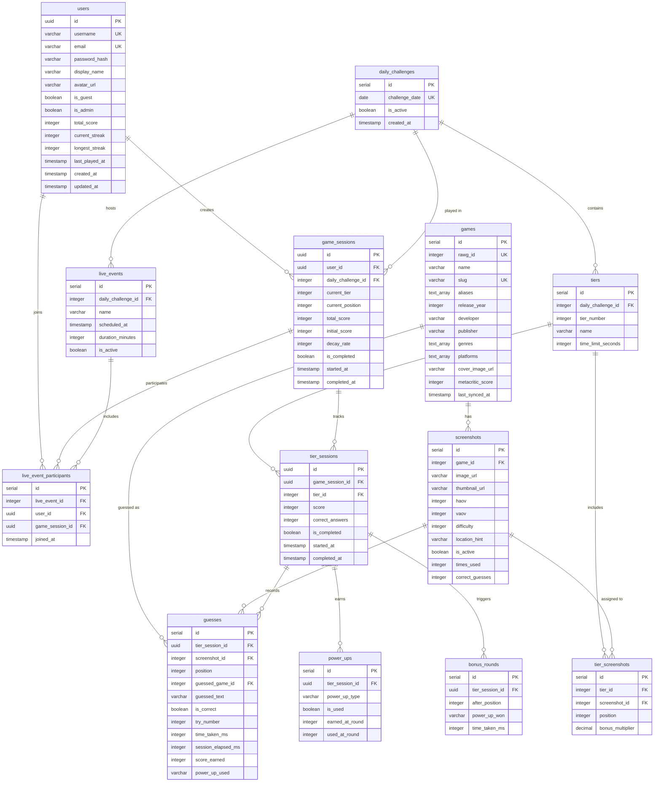

# Schéma de base de données

The Box stocke ses données dans PostgreSQL et gère ses migrations avec Knex.js. Document destiné aux développeurs backend et aux personnes en charge des données.

> **À noter.** Ce document décrit les tables historiques du jeu. Les modules récents — **mode Géo** (`geo_*`), **abonnements Stripe** (`subscriptions`, `stripe_event_processed`), **parrainage** (`referral_*`), **journal d'audit admin** (`admin_audit_log`), **signalements de captures** (`screenshot_reports`), **e-mails envoyés** (`email_log`) et **Better Auth** (`user`, `session`, `account`, `verification`) — ne sont pas encore documentés ici. Référez-vous aux migrations sous `packages/backend/migrations/` pour le détail à jour.

## Diagramme entité-relation


```mermaid
erDiagram
    users ||--o{ game_sessions : creates
    users ||--o{ live_event_participants : joins
    
    games ||--o{ screenshots : has
    games ||--o{ guesses : "guessed as"
    
    daily_challenges ||--o{ tiers : contains
    daily_challenges ||--o{ game_sessions : "played in"
    daily_challenges ||--o{ live_events : hosts
    
    tiers ||--o{ tier_screenshots : includes
    tiers ||--o{ tier_sessions : "progresses through"
    
    screenshots ||--o{ tier_screenshots : "assigned to"
    screenshots ||--o{ guesses : "shown in"
    
    game_sessions ||--o{ tier_sessions : tracks
    game_sessions ||--o{ live_event_participants : participates
    
    tier_sessions ||--o{ guesses : records
    tier_sessions ||--o{ power_ups : earns
    tier_sessions ||--o{ bonus_rounds : triggers
    
    live_events ||--o{ live_event_participants : includes
    
    users {
        uuid id PK
        varchar username UK
        varchar email UK
        varchar password_hash
        varchar display_name
        varchar avatar_url
        boolean is_guest
        boolean is_admin
        integer total_score
        integer current_streak
        integer longest_streak
        timestamp last_played_at
        timestamp created_at
        timestamp updated_at
    }
    
    games {
        serial id PK
        integer rawg_id UK
        varchar name
        varchar slug UK
        text_array aliases
        integer release_year
        varchar developer
        varchar publisher
        text_array genres
        text_array platforms
        varchar cover_image_url
        integer metacritic_score
        timestamp last_synced_at
    }
    
    screenshots {
        serial id PK
        integer game_id FK
        varchar image_url
        varchar thumbnail_url
        integer haov
        integer vaov
        integer difficulty
        varchar location_hint
        boolean is_active
        integer times_used
        integer correct_guesses
    }
    
    daily_challenges {
        serial id PK
        date challenge_date UK
        boolean is_active
        timestamp created_at
    }
    
    tiers {
        serial id PK
        integer daily_challenge_id FK
        integer tier_number
        varchar name
        integer time_limit_seconds
    }
    
    tier_screenshots {
        serial id PK
        integer tier_id FK
        integer screenshot_id FK
        integer position
        decimal bonus_multiplier
    }
    
    game_sessions {
        uuid id PK
        uuid user_id FK
        integer daily_challenge_id FK
        integer current_tier
        integer current_position
        integer total_score
        integer initial_score
        integer decay_rate
        boolean is_completed
        timestamp started_at
        timestamp completed_at
    }
    
    tier_sessions {
        uuid id PK
        uuid game_session_id FK
        integer tier_id FK
        integer score
        integer correct_answers
        boolean is_completed
        timestamp started_at
        timestamp completed_at
    }
    
    guesses {
        serial id PK
        uuid tier_session_id FK
        integer screenshot_id FK
        integer position
        integer guessed_game_id FK
        varchar guessed_text
        boolean is_correct
        integer try_number
        integer time_taken_ms
        integer session_elapsed_ms
        integer score_earned
        varchar power_up_used
    }
    
    power_ups {
        serial id PK
        uuid tier_session_id FK
        varchar power_up_type
        boolean is_used
        integer earned_at_round
        integer used_at_round
    }
    
    bonus_rounds {
        serial id PK
        uuid tier_session_id FK
        integer after_position
        varchar power_up_won
        integer time_taken_ms
    }
    
    live_events {
        serial id PK
        integer daily_challenge_id FK
        varchar name
        timestamp scheduled_at
        integer duration_minutes
        boolean is_active
    }
    
    live_event_participants {
        serial id PK
        integer live_event_id FK
        uuid user_id FK
        uuid game_session_id FK
        timestamp joined_at
    }
```

## Tables

> **Détail technique.** Les colonnes ci-dessous reflètent l'état documenté historiquement. Les colonnes ajoutées par migrations récentes (par ex. `last_login_at` sur `users`) doivent être vérifiées dans les fichiers de migration correspondants.

### users

Comptes des joueurs et statistiques associées.

| Column | Type | Description |
| ------ | ---- | ----------- |
| id | UUID | Primary key |
| username | VARCHAR(50) | Unique username |
| email | VARCHAR(255) | Unique email |
| password_hash | VARCHAR(255) | Bcrypt hash |
| display_name | VARCHAR(100) | Display name |
| avatar_url | VARCHAR(500) | Avatar image URL |
| is_guest | BOOLEAN | Guest account flag |
| is_admin | BOOLEAN | Admin privileges |
| total_score | INTEGER | Lifetime score |
| current_streak | INTEGER | Current daily streak |
| longest_streak | INTEGER | Best streak |
| last_played_at | TIMESTAMP | Last game played |
| created_at | TIMESTAMP | Account creation |
| updated_at | TIMESTAMP | Last update |

### games

Catalogue de jeux vidéo, alimenté par l'intégration RAWG.

| Column | Type | Description |
| ------ | ---- | ----------- |
| id | SERIAL | Primary key |
| rawg_id | INTEGER | Unique RAWG database ID |
| name | VARCHAR(255) | Game title |
| slug | VARCHAR(255) | URL-friendly name |
| aliases | TEXT[] | Alternative names |
| release_year | INTEGER | Year released |
| developer | VARCHAR(255) | Developer name |
| publisher | VARCHAR(255) | Publisher name |
| genres | TEXT[] | Genre tags |
| platforms | TEXT[] | Platform tags |
| cover_image_url | VARCHAR(500) | Cover image |
| metacritic_score | INTEGER | Metacritic score (0-100) |
| last_synced_at | TIMESTAMP | Last RAWG sync timestamp |

### screenshots

Captures d'écran de jeux (panoramiques 360° pour les anciennes versions, classiques aujourd'hui).

| Column | Type | Description |
| ------ | ---- | ----------- |
| id | SERIAL | Primary key |
| game_id | INTEGER | FK to games |
| image_url | VARCHAR(500) | Image path |
| thumbnail_url | VARCHAR(500) | Thumbnail path |
| haov | INTEGER | Horizontal angle of view |
| vaov | INTEGER | Vertical angle of view |
| difficulty | INTEGER | 1-3 difficulty rating |
| location_hint | VARCHAR(255) | Optional hint |
| is_active | BOOLEAN | Available for use |
| times_used | INTEGER | Usage counter |
| correct_guesses | INTEGER | Correct guess counter |

### daily_challenges

Configuration des défis quotidiens.

| Column | Type | Description |
| ------ | ---- | ----------- |
| id | SERIAL | Primary key |
| challenge_date | DATE | Unique date |
| is_active | BOOLEAN | Published flag |
| created_at | TIMESTAMP | Creation time |

### tiers

Paliers de difficulté à l'intérieur d'un défi.

| Column | Type | Description |
| ------ | ---- | ----------- |
| id | SERIAL | Primary key |
| daily_challenge_id | INTEGER | FK to daily_challenges |
| tier_number | INTEGER | 1, 2, or 3 |
| name | VARCHAR(50) | Tier name |
| time_limit_seconds | INTEGER | Timer duration |

### tier_screenshots

Captures rattachées à un palier.

| Column | Type | Description |
| ------ | ---- | ----------- |
| id | SERIAL | Primary key |
| tier_id | INTEGER | FK to tiers |
| screenshot_id | INTEGER | FK to screenshots |
| position | INTEGER | Order (1-18) |
| bonus_multiplier | DECIMAL | Score multiplier |

### game_sessions

Tentatives des joueurs sur un défi.

| Column | Type | Description |
| ------ | ---- | ----------- |
| id | UUID | Primary key |
| user_id | UUID | FK to users |
| daily_challenge_id | INTEGER | FK to daily_challenges |
| current_tier | INTEGER | Current tier number |
| current_position | INTEGER | Current screenshot |
| total_score | INTEGER | Accumulated score |
| initial_score | INTEGER | Starting countdown score (default 1000) |
| decay_rate | INTEGER | Points lost per second (default 2) |
| is_completed | BOOLEAN | Finished flag |
| started_at | TIMESTAMP | Start time |
| completed_at | TIMESTAMP | Completion time |

### tier_sessions

Suivi de la progression palier par palier.

| Column | Type | Description |
| ------ | ---- | ----------- |
| id | UUID | Primary key |
| game_session_id | UUID | FK to game_sessions |
| tier_id | INTEGER | FK to tiers |
| score | INTEGER | Tier score |
| correct_answers | INTEGER | Correct count |
| is_completed | BOOLEAN | Finished flag |
| started_at | TIMESTAMP | Start time |
| completed_at | TIMESTAMP | Completion time |

### guesses

Réponses individuelles des joueurs.

| Column | Type | Description |
| ------ | ---- | ----------- |
| id | SERIAL | Primary key |
| tier_session_id | UUID | FK to tier_sessions |
| screenshot_id | INTEGER | FK to screenshots |
| position | INTEGER | Screenshot position |
| guessed_game_id | INTEGER | FK to games (if matched) |
| guessed_text | VARCHAR(255) | Raw guess text |
| is_correct | BOOLEAN | Correct flag |
| try_number | INTEGER | Which try (1-3) for this screenshot |
| time_taken_ms | INTEGER | Response time |
| session_elapsed_ms | INTEGER | Time since session started |
| score_earned | INTEGER | Points earned |
| power_up_used | VARCHAR(50) | Power-up if used |

### power_ups

Bonus disponibles pour les joueurs.

| Column | Type | Description |
| ------ | ---- | ----------- |
| id | SERIAL | Primary key |
| tier_session_id | UUID | FK to tier_sessions |
| power_up_type | VARCHAR(50) | x2_timer, hint |
| is_used | BOOLEAN | Used flag |
| earned_at_round | INTEGER | Round earned |
| used_at_round | INTEGER | Round used |

### bonus_rounds

Tours bonus complétés pendant un palier.

| Column | Type | Description |
| ------ | ---- | ----------- |
| id | SERIAL | Primary key |
| tier_session_id | UUID | FK to tier_sessions |
| after_position | INTEGER | Position after which bonus triggered |
| power_up_won | VARCHAR(50) | Power-up earned |
| time_taken_ms | INTEGER | Time to complete bonus |

### live_events

Événements compétitifs programmés.

| Column | Type | Description |
| ------ | ---- | ----------- |
| id | SERIAL | Primary key |
| daily_challenge_id | INTEGER | FK to daily_challenges |
| name | VARCHAR(255) | Event name |
| scheduled_at | TIMESTAMP | Event start time |
| duration_minutes | INTEGER | Event duration |
| is_active | BOOLEAN | Active flag |

### live_event_participants

Participants à un événement en direct.

| Column | Type | Description |
| ------ | ---- | ----------- |
| id | SERIAL | Primary key |
| live_event_id | INTEGER | FK to live_events |
| user_id | UUID | FK to users |
| game_session_id | UUID | FK to game_sessions (nullable) |
| joined_at | TIMESTAMP | Join time |

### import_states

Suit la progression des imports en arrière-plan (pause / reprise).

| Column | Type | Description |
| ------ | ---- | ----------- |
| id | SERIAL | Primary key |
| import_type | VARCHAR(50) | Type of import (games, screenshots) |
| current_page | INTEGER | Current page being processed |
| total_pages | INTEGER | Total pages to process |
| status | VARCHAR(20) | running, paused, completed, failed |
| last_error | TEXT | Last error message if failed |
| created_at | TIMESTAMP | Import start time |
| updated_at | TIMESTAMP | Last update time |

## Migrations

```bash
# Jouer toutes les migrations en attente
npm run db:migrate

# Annuler la dernière migration
npm run db:rollback

# Créer une nouvelle migration
npm run db:make-migration -- nom_migration

# Seeder la base (crée l'utilisateur admin)
npm run db:seed
```

> **Convention.** Les fichiers de migration sont préfixés par la date (`YYYYMMDD_nom.ts`) et exécutés dans l'ordre chronologique. Ne jamais éditer une migration déjà appliquée en production — créer une nouvelle migration.

## Seeding

Un fichier de seed initial crée un utilisateur administrateur :

| Champ | Valeur |
|-------|--------|
| E-mail | `admin@thebox.local` |
| Nom d'utilisateur | `admin` |
| Mot de passe | `admin123` |
| Rôle | `admin` |

Lancement :

```bash
# Dev local
npm run db:seed

# Conteneur Docker
docker exec the-box npm run --workspace=@the-box/backend db:seed
```

Le seed s'arrête si l'admin existe déjà.

## Index

Index principaux pour la performance :

- `users.username` - Unique
- `users.email` - Unique
- `games.name` - For search
- `games.slug` - Unique
- `games.rawg_id` - Unique
- `daily_challenges.challenge_date` - Unique
- `tiers(daily_challenge_id, tier_number)` - Unique
- `tier_screenshots(tier_id, position)` - Unique
- `game_sessions(user_id, daily_challenge_id)` - Unique
- `guesses(tier_session_id, position)` - For efficient try counting
- `live_event_participants(live_event_id, user_id)` - Unique
