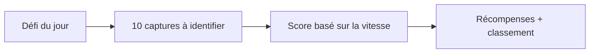
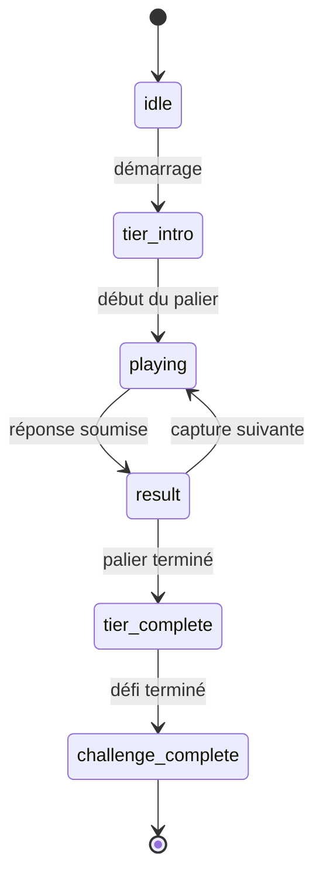
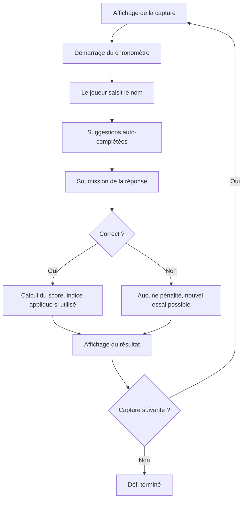

# Mécanique de jeu

Document destiné aux Product Owners et développeurs qui souhaitent comprendre les règles, le scoring et la progression d'une partie.

## Vue d'ensemble

Les joueurs identifient un jeu vidéo à partir d'une capture d'écran. Chaque défi quotidien comporte une série de captures à reconnaître.



## Phases d'une partie



| Phase | Description |
|-------|-------------|
| `idle` | En attente du démarrage |
| `tier_intro` | Présentation du palier et des règles |
| `playing` | Partie active, chronomètre en cours |
| `result` | Affichage de la bonne réponse |
| `tier_complete` | Bilan du palier |
| `challenge_complete` | Bilan global du défi |

## Système de scoring

### Score basé sur la vitesse

Plus la réponse est rapide, plus le score est élevé.

| Temps de réponse | Multiplicateur | Points obtenus |
|------------------|----------------|----------------|
| < 3 secondes | 2,0x | 200 points |
| < 5 secondes | 1,75x | 175 points |
| < 10 secondes | 1,5x | 150 points |
| < 20 secondes | 1,25x | 125 points |
| ≥ 20 secondes | 1,0x | 100 points |

> **Détail technique.** Score de base : 100 points par capture. Plafond : 200 points par capture. Calcul dans `domain/services/game.service.ts` :
>
> ```typescript
> function calculateSpeedMultiplier(timeTakenMs: number): number {
>   const t = timeTakenMs / 1000
>   if (t < 3) return 2.0
>   if (t < 5) return 1.75
>   if (t < 10) return 1.5
>   if (t < 20) return 1.25
>   return 1.0
> }
> scoreEarned = Math.min(200, Math.round(100 * calculateSpeedMultiplier(timeTakenMs)))
> ```

### Pénalités

- **Mauvaise réponse :** aucune pénalité — les essais multiples sont autorisés
- **Indice utilisé :** −20 % du score gagné sur la capture concernée
- **Capture non trouvée :** aucune pénalité (en cas d'arrêt anticipé)

### Score maximal

- 200 points par capture (vitesse parfaite, sans indice)
- 2 000 points pour un défi de 10 captures (théorique)

## Bonus et indices

| Bonus | Effet | Obtention |
|-------|-------|-----------|
| `x2_timer` | Double le temps restant | Toutes les 6 bonnes réponses |
| `hint` | Révèle la première lettre | Tour bonus aléatoire |

Des tours bonus peuvent apparaître après les positions 6, 12 et 18 et offrir un bonus.

## Boucle de jeu



## Flux API

> **Détail technique.** Les endpoints suivants supportent un cycle complet de partie. Voir [Référence API](./api.md) pour les schémas complets.

### Récupérer le défi du jour

```http
GET /api/game/today
```

```json
{
  "challengeId": 1,
  "date": "2025-01-10",
  "totalScreenshots": 10,
  "hasPlayed": false,
  "userSession": null
}
```

### Démarrer une session

```http
POST /api/game/start/:challengeId
```

```json
{
  "sessionId": "uuid",
  "tierSessionId": "uuid",
  "totalScreenshots": 10,
  "sessionStartedAt": "2025-01-10T14:30:00.000Z"
}
```

### Récupérer une capture

```http
GET /api/game/screenshot?sessionId=xxx&position=1
```

```json
{
  "position": 1,
  "imageUrl": "/uploads/screenshots/game1.jpg",
  "timeLimit": 30,
  "bonusMultiplier": 1.0
}
```

### Soumettre une réponse

```http
POST /api/game/guess
```

Requête :

```json
{
  "tierSessionId": "uuid",
  "screenshotId": 1,
  "position": 1,
  "gameId": 42,
  "guessText": "The Witcher 3"
}
```

Réponse correcte :

```json
{
  "isCorrect": true,
  "correctGame": { "id": 42, "name": "The Witcher 3: Wild Hunt" },
  "scoreEarned": 175,
  "totalScore": 175,
  "nextPosition": 2,
  "isCompleted": false
}
```

## État côté frontend

> **Détail technique.** Le store Zustand `gameStore` conserve l'état de la session.

```typescript
interface GameState {
  sessionId: string | null
  challengeId: number | null
  currentPosition: number
  sessionStartedAt: string | null
  totalScore: number
  screenshotsFound: number
  correctPositions: number[]
  guessResults: GuessResult[]
  availablePowerUps: PowerUp[]
}
```
