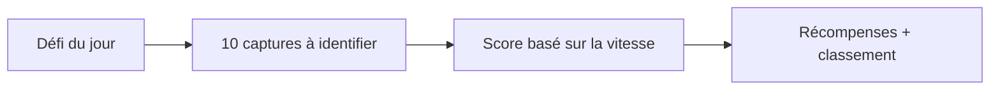
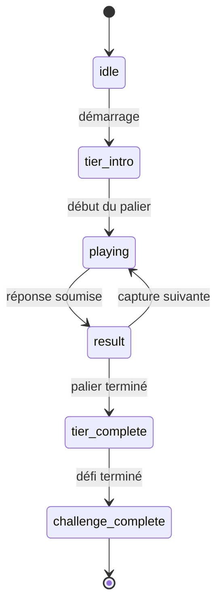
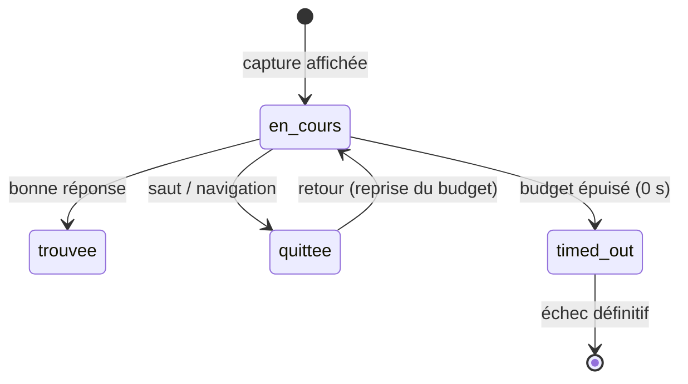
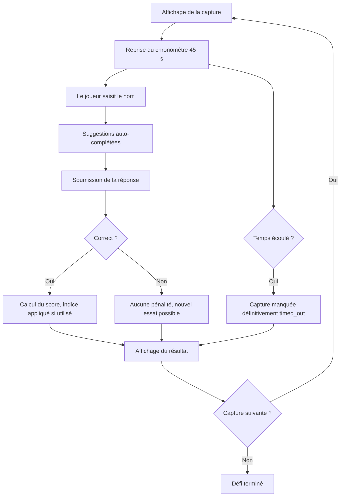

# Mécanique de jeu

Document destiné aux Product Owners et développeurs qui souhaitent comprendre les règles, le scoring et la progression d'une partie.

## Vue d'ensemble

Les joueurs identifient un jeu vidéo à partir d'une capture d'écran. Chaque défi quotidien comporte une série de captures à reconnaître.



## Phases d'une partie



| Phase | Description |
|-------|-------------|
| `idle` | En attente du démarrage |
| `tier_intro` | Présentation du palier et des règles |
| `playing` | Partie active, chronomètre en cours |
| `result` | Affichage de la bonne réponse |
| `tier_complete` | Bilan du palier |
| `challenge_complete` | Bilan global du défi |

## Chronomètre par capture

Chaque capture dispose d'un **compte à rebours de 45 secondes** (anneau circulaire affiché en haut à gauche). La durée provient du palier (`tiers.time_limit_seconds`, défaut 45) et est transmise au client via `ScreenshotResponse.timeLimitSeconds`.



- **Échec définitif (`timed_out`).** À 0 seconde, la capture est **définitivement manquée** : elle est verrouillée (statut `timed_out`, non rejouable) et révélée comme non trouvée à la fin du défi. Contrairement à une capture *sautée*, on ne peut pas y revenir.
- **Budget de temps actif (anti-triche).** Le compte à rebours mesure le temps réellement passé **sur la capture**, pas le temps écoulé depuis sa première vue. Quitter une capture (saut, navigation, clic sur une pastille) met le décompte **en pause** ; y revenir le **reprend** là où il s'était arrêté. Il est donc impossible de réinitialiser le chronomètre en passant à la capture suivante puis en revenant.
- **Persistance.** Le temps déjà consommé par position (`PositionState.timeSpentMs`) est persisté, donc un rafraîchissement de page ne remet pas le budget à zéro.
- **Côté serveur.** L'application du chronomètre est côté client (v1) ; le serveur reste autoritatif sur le temps de réponse utilisé pour le multiplicateur de vitesse (`Math.max(temps serveur, temps client)`), si bien que le temps cumulé envoyé par le client empêche aussi de réinitialiser le multiplicateur.

## Système de scoring

### Score basé sur la vitesse

Plus la réponse est rapide, plus le score est élevé.

| Temps de réponse | Multiplicateur | Points obtenus |
|------------------|----------------|----------------|
| < 3 secondes | 2,0x | 200 points |
| < 5 secondes | 1,75x | 175 points |
| < 10 secondes | 1,5x | 150 points |
| < 20 secondes | 1,25x | 125 points |
| ≥ 20 secondes | 1,0x | 100 points |

> **Détail technique.** Score de base : 100 points par capture. Plafond : 200 points par capture. Calcul dans `domain/services/game.service.ts` :
>
> ```typescript
> function calculateSpeedMultiplier(timeTakenMs: number): number {
>   const t = timeTakenMs / 1000
>   if (t < 3) return 2.0
>   if (t < 5) return 1.75
>   if (t < 10) return 1.5
>   if (t < 20) return 1.25
>   return 1.0
> }
> scoreEarned = Math.min(200, Math.round(100 * calculateSpeedMultiplier(timeTakenMs)))
> ```

### Pénalités

- **Mauvaise réponse :** aucune pénalité — les essais multiples sont autorisés
- **Indice utilisé :** −20 % du score gagné sur la capture concernée
- **Capture non trouvée :** aucune pénalité (arrêt anticipé ou **temps écoulé** — la capture `timed_out` est révélée comme non trouvée à la fin)

### Score maximal

- 200 points par capture (vitesse parfaite, sans indice)
- 2 000 points pour un défi de 10 captures (théorique)

## Bonus et indices

| Bonus | Effet | Obtention |
|-------|-------|-----------|
| `x2_timer` | Double le temps restant | Toutes les 6 bonnes réponses |
| `hint` | Révèle la première lettre | Tour bonus aléatoire |

Des tours bonus peuvent apparaître après les positions 6, 12 et 18 et offrir un bonus.

### Catalogue des power-ups (`item_type='powerup'`)

| `item_key` | Effet | Sources d'obtention |
|---|---|---|
| `hint_year` | Révèle l'année de sortie | Daily-login (jours 1, 4, 7), parrainage |
| `hint_publisher` | Révèle l'éditeur | Daily-login (jours 2, 5, 7), parrainage |
| `hint_developer` | Révèle le développeur | Daily-login (jour 7), parrainage |
| `hint_genre` | Révèle le tag de genre principal | Daily-login (jour 7), parrainage |
| `hint_letter` | Révèle une lettre du titre masqué (voir ci-dessous) | Daily-login (jour 7) |
| `streak_freeze` | Préserve la série lorsqu'un jour est manqué | Octroi mensuel automatique uniquement |
| `second_chance` | Garantit un score plancher (FLOOR) de 70 points sur la prochaine bonne réponse à la position | Daily-login (jour 7), parrainage |

### Révélation de lettres (titre masqué)

Le titre reste **entièrement caché** avant la première révélation payante : le serveur envoie un masque vide, donc même le nombre de mots et de lettres n'est pas visible (ni dans l'UI, ni dans la réponse réseau). La première révélation dévoile à la fois le squelette (espaces, chiffres, ponctuation et articles initiaux The/A/Le/La/Les/L' visibles d'office, ex. `E____ R___`) et la première lettre ; chaque révélation suivante dévoile la lettre masquée suivante, de gauche à droite.

| Règle | Contrat |
|---|---|
| Côté serveur | `POST /api/game/reveal-letter` est la seule source du masque — le titre complet ne quitte jamais le backend avant résolution. Le masque est une fonction pure de `(gameName, letters_revealed)` (table `position_letter_reveals`), donc idempotent au refresh. |
| Porte d'entrée | La première lettre payante exige **au moins une mauvaise réponse** sur la position (avant cela, même le squelette reste caché). |
| Plafond anti-fuite | `min(2, ceil(lettres_masquables × 0.3))`, **vérifié dynamiquement contre le fuzzy matcher** (`effectiveMaxReveals`) : aucun fragment révélé ne peut être accepté comme réponse gagnante. Test unitaire bloquant (`letter-reveal.service.test.ts`). Certains titres courts ou à article (ex. « La Mulana ») peuvent n'autoriser aucune lettre. |
| Coût | Convexe : -15 % puis -20 % (cumul -35 %) du score de la position, verrouillé au moment de la révélation, appliqué après le plafond de 200 et **avant** le plancher `second_chance`. Le coût en score s'applique **même si l'objet vient de l'inventaire**. |
| Défi du jour (classé) | Chaque révélation **consomme un item `hint_letter`** ; sans inventaire → 402 `NO_INVENTORY` (upsell). |
| Catch-up | Pas d'inventaire requis (hors classement). Premium : révélations **gratuites** (pénalité 0) en catch-up uniquement — jamais sur le défi du jour. |
| Anti-fuite (réponse) | La réponse d'une mauvaise tentative n'expose **ni `correctGame` ni `availableHints`** — sinon une seule mauvaise réponse offrirait le nom du jeu en devtools. |

### Invariants de l'économie de récompense

- **`streak_freeze` n'est jamais achetable.** L'unique chemin d'acquisition est l'octroi mensuel automatique (worker BullMQ `streak-freeze-grant`, plafonné à 2 par utilisateur). Vendre cet objet recréerait le piège de coût irrécupérable qu'il a été conçu pour désamorcer. Toute future boutique doit explicitement exclure `streak_freeze` de son catalogue de SKU.
- **L'auto-consommation du `streak_freeze`** ne couvre **qu'un seul jour manqué**. Plusieurs jours d'absence consécutifs réinitialisent la série normalement, indépendamment du stock de protections.
- **L'usage d'un indice** (year / publisher / developer / genre) coûte soit un item d'inventaire (gratuit), soit -20 % du score gagné sur la position.
- **`second_chance` est un PLANCHER, pas un plafond.** Le PRD initial évoquait littéralement « score plafonné à 70 % », mais cette interprétation rendrait le power-up punitif dans le modèle actuel (les essais multiples sont déjà permis, l'objet ne peut donc pas accorder une chance qui n'existe pas déjà). Implémenté comme : une activation pour une position garantit `max(scoreEarned, 70)` sur la prochaine bonne réponse à cette position. C'est la seule lecture qui rend le power-up à valeur positive pour le joueur. Toute évolution future de cette sémantique doit être discutée dans une réunion design avant d'être codée.
- **Activation `second_chance` réactive (modale)** déclenchée après une mauvaise réponse, dismissable. Refuser ne consomme pas l'inventaire. Une activation au plus par couple `(tier_session, position)`.

### Payout mensuel du classement

Le worker BullMQ `leaderboard-payout-monthly` s'exécute le 1er de chaque mois à 00:30 UTC et accorde un cadre cosmétique au top 100 du **mois précédent**.

| Aspect | Décision |
|---|---|
| Récompense | Cadre cosmétique horodaté `frame_top100_YYYY_MM` (ex. `frame_top100_2026_05`) |
| Type d'item | `cosmetic` dans `user_inventory` (jamais des points ni de l'argent virtuel) |
| Bénéficiaires | Top 100 mensuel uniquement (pas de top quotidien dans cette première itération) |
| Idempotence | `reward_grants` UNIQUE sur `(user_id, leaderboard_payout, leaderboard_payout:monthly:YYYY-MM)` — relancer le cron est sûr |
| Échangeable | **Non** — l'inventaire n'a aucun mécanisme de transfert |
| Cadence | Une SKU distincte par mois ; un cadre obtenu en mai 2026 reste un témoignage historique |
| **UI à bannir** | **Aucun countdown** sur la page leaderboard (« plus que 3 jours pour entrer dans le top 100 ! »). Per la réunion (veto Nour) : la rareté est *historique* (datée), pas *manufacturée* (FOMO). Le badge se découvre comme une reconnaissance silencieuse, pas comme une carotte de pression temporelle. |

## Boucle de jeu



## Flux API

> **Détail technique.** Les endpoints suivants supportent un cycle complet de partie. Voir [Référence API](./api.md) pour les schémas complets.

### Récupérer le défi du jour

```http
GET /api/game/today
```

```json
{
  "challengeId": 1,
  "date": "2025-01-10",
  "totalScreenshots": 10,
  "hasPlayed": false,
  "userSession": null
}
```

### Démarrer une session

```http
POST /api/game/start/:challengeId
```

```json
{
  "sessionId": "uuid",
  "tierSessionId": "uuid",
  "totalScreenshots": 10,
  "sessionStartedAt": "2025-01-10T14:30:00.000Z"
}
```

### Récupérer une capture

```http
GET /api/game/screenshot?sessionId=xxx&position=1
```

```json
{
  "screenshotId": 1,
  "position": 1,
  "imageUrl": "/api/game/image/1",
  "bonusMultiplier": 1.0,
  "timeLimitSeconds": 45
}
```

### Soumettre une réponse

```http
POST /api/game/guess
```

Requête :

```json
{
  "tierSessionId": "uuid",
  "screenshotId": 1,
  "position": 1,
  "gameId": 42,
  "guessText": "The Witcher 3"
}
```

Réponse correcte :

```json
{
  "isCorrect": true,
  "correctGame": { "id": 42, "name": "The Witcher 3: Wild Hunt" },
  "scoreEarned": 175,
  "totalScore": 175,
  "nextPosition": 2,
  "isCompleted": false
}
```

## État côté frontend

> **Détail technique.** Le store Zustand `gameStore` conserve l'état de la session.

```typescript
interface GameState {
  sessionId: string | null
  challengeId: number | null
  currentPosition: number
  sessionStartedAt: string | null
  totalScore: number
  screenshotsFound: number
  correctPositions: number[]
  guessResults: GuessResult[]
  availablePowerUps: PowerUp[]
}
```
