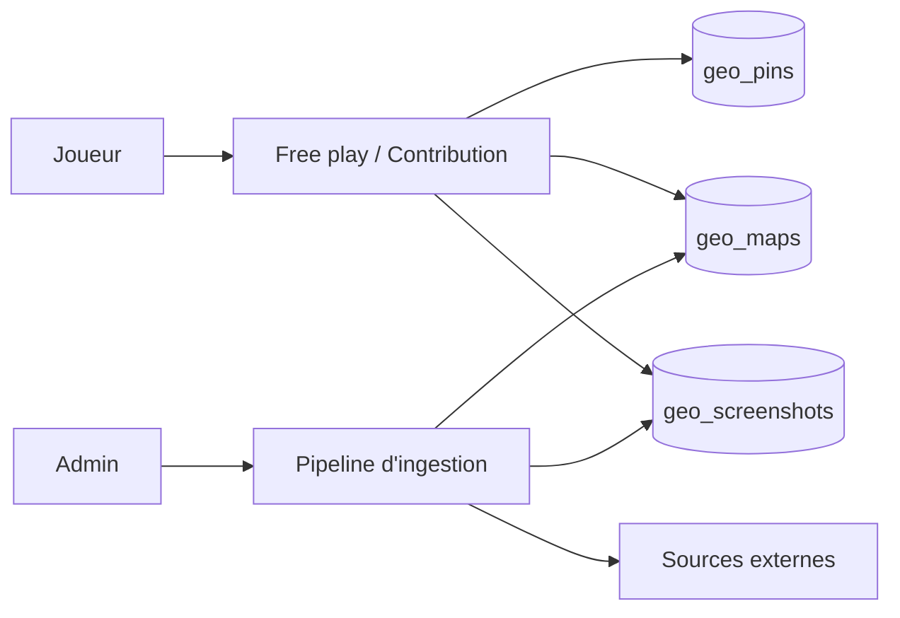
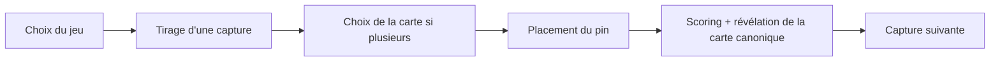
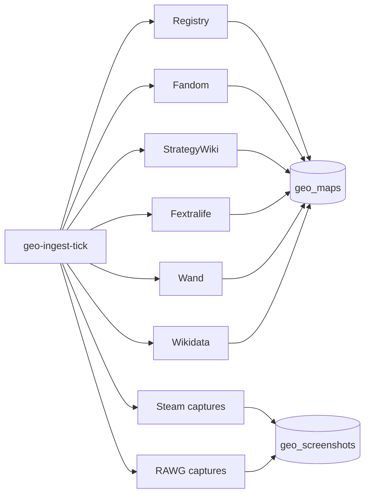

# Mode Géo

Le mode Géo invite le joueur à localiser sur une carte de jeu (Elden Ring, etc.) la scène d'une capture d'écran. Document destiné aux Product Owners et développeurs qui veulent comprendre la mécanique, les sources de données et le pipeline d'ingestion.

## Vue d'ensemble

Trois activités cohabitent :

- **Free play** — le joueur place un pin sur la carte et reçoit un score selon la distance à la position canonique. Sans impact sur le classement.
- **Contribution** — le joueur place un pin sur une capture sans coordonnées canoniques. Le système agrège les pins (consensus) et promeut une position canonique au-delà d'un seuil de fiabilité.
- **Pipeline d'ingestion** — un orchestrateur admin fait tourner plusieurs workers d'import pour rapatrier des cartes de jeu et des captures depuis des sources externes.

### Kill switch de la surface communautaire

Les deux premières activités (free play + contribution, servies par `/api/geo`) sont gouvernées par `GEO_COMMUNITY_ENABLED` (défaut `true`). À `false`, les routes joueur sont démontées (404) et le frontend masque l'entrée de navigation Géo et les cartes d'accueil (via `GET /api/features`) — le mode peut donc être mis en sommeil si la constitution du dataset passe au sourcing agent (voir `docs/geo-agent-api.md`) plutôt qu'au crowdsourcing. La **couche de données géo n'est pas touchée** : pipeline d'ingestion, API agent, panel admin Geo-Fetch et GeoGamers continuent de fonctionner (ils ne passent pas par `/api/geo`), et le worker de consensus reste actif car les propositions de pins agent l'alimentent toujours.

## Mécanique de jeu (free play)

### Scoring

> **Détail technique.** Implémentation dans `domain/services/geo-scoring.service.ts`.

Le score est calculé par décroissance exponentielle de la distance euclidienne normalisée entre le pin du joueur et la position canonique.

| Constante | Valeur | Rôle |
|-----------|--------|------|
| `GEO_SCORE_MAX` | 2000 | Score maximum pour un pin parfait (distance 0) |
| `GEO_SCORE_DECAY` | 8 | Taux de décroissance exponentielle |
| `GEO_SCORE_VERSION` | 2 | Version de la formule (introduit la pénalité « mauvaise carte ») |

Distance normalisée : `sqrt(dx² + dy²) / sqrt(2)` (carré unité [0..1]). Score : `round(MAX × exp(-DECAY × distance))`.

| Distance normalisée | Score approximatif |
|---------------------|-------------------|
| 0 % (pin parfait) | 2000 |
| 10 % | ~900 |
| 25 % | ~270 |
| 50 % | ~37 |
| 100 % (mauvaise carte) | ~1 |

Si le joueur sélectionne **la mauvaise carte** parmi celles disponibles pour le jeu, la distance est forcée à 1.0 (pénalité maximale, ~1 point).

### Boucle de jeu

## Contribution crowdsourcée

> **Détail technique.** Implémentation dans `domain/services/geo-game.service.ts` et `geo-consensus.service.ts`.

Quand une capture n'a pas (encore) de position canonique, on demande aux joueurs de la placer. Le service de consensus agrège les pins :

| Constante | Valeur | Rôle |
|-----------|--------|------|
| `GEO_CONSENSUS_THRESHOLDS` | `[5, 10, 20, 50]` | Recompute le consensus à ces seuils de pins |
| `GEO_CONSENSUS_MIN_PINS_TO_PROMOTE` | 5 | Nombre minimal de pins avant promotion canonique |
| `GEO_CONSENSUS_SIGMA_MULTIPLIER` | 2 | Pins à plus de 2σ du centroïde sont rejetés |
| `GEO_CONTRIBUTE_HOURLY_LIMIT` | 20 | Limite de pins par utilisateur et par heure |
| `GEO_CONTRIBUTE_MIN_DAYS_PLAYED` | 3 | Jours de jeu distincts requis pour contribuer (anti-spam) |

L'algorithme calcule le centroïde des pins et leur écart-type sur chaque axe. Les pins trop éloignés sont rejetés. La promotion canonique nécessite assez de pins **et** un cluster suffisamment serré (`confidence > 0.5`).

> **Consensus v3 (issue #331).** Les pins peuvent porter une provenance (`source`) : `human`, `agent_structured` (×0,6) ou `agent_vision` (×0,25). Les pins d'agent sont **sous-pondérés** dans le centroïde et — surtout — **exclus du compteur de promotion** : la promotion exige `GEO_CONSENSUS_MIN_PINS_TO_PROMOTE` pins **humains** acceptés (ou un override admin). Un pin machine peut donc affiner la position mais **jamais** créer une vérité terrain à lui seul. Voir `docs/geo-agent-api.md`.

### Récompense

Le joueur qui pose **le tout premier pin** sur une capture reçoit un bonus (`hint_year`) — petite récompense pour encourager la découverte sans dépasser les bonus de précision attribués ensuite.

## Pipeline d'ingestion (admin)

> **Périmètre.** Le pipeline est exposé sous `/api/admin/geo-fetch` (réservé admin). Il alimente la table `geo_maps` (cartes) et `geo_screenshots` (candidates de captures).

### Sources supportées

Six tiers d'ingestion sont tentés en parallèle pour chaque jeu. Le premier qui réussit devient la carte active par défaut ; les autres restent disponibles comme alternatives.

| Tier | Source | Worker | Conditions |
|------|--------|--------|------------|
| 1 | Registre GitHub Leaflet curé | `geo-registry-import-logic.ts` | Slug présent dans le registre |
| 2 | Fandom Interactive Maps | `geo-fandom-import-logic.ts` | `wiki_subdomain` + page de carte résolus |
| 3 | StrategyWiki (CC-BY-SA) | `geo-strategywiki-import-logic.ts` | Sondage inline (slug + nom) |
| 4 | Fextralife (RPG / Soulsborne) | `geo-fextralife-import-logic.ts` | Sondage inline (og:image) |
| 5 | wand.com (gated Cloudflare) | `geo-wand-import-logic.ts` | Sondage inline (slug) |
| 6 | Wikidata `P242` (locator map) | `geo-wikidata-import-logic.ts` | `wikidata_qid` résolu |

Captures additionnelles :

- `geo-steam-import-logic.ts` — captures Steam
- `geo-rawg-import-logic.ts` — captures RAWG
- Plafond combiné par jeu : 30 candidatures actives (`CAPTURE_TARGET_CANDIDATES`)

### Pipeline orchestré

Le worker `geo-ingest-tick-logic.ts` parcourt les jeux résolus, repère ceux qui n'ont pas atteint le quota de candidatures et enqueue le travail correspondant pour chaque tier éligible. Le résolveur de métadonnées (`geo-metadata-resolve-logic.ts`) renseigne au préalable `wiki_subdomain`, `wikidata_qid`, `steam_app_id`, etc.

### Backfill discovery (issue #331, phase 6)

Le tick d'ingestion normal complète **tous** les jeux résolus (y compris ceux déjà éligibles) vers le quota de candidatures. Le worker de **backfill** (`geo-backfill-logic.ts`, `backfill-tick`) inverse cette logique : il classe les jeux curés+résolus **non encore éligibles** par distance à l'éligibilité (`geo-backfill.service.ts` : carte active ? captures qui collectent des pins ? nombre de pins max ?) et relance l'ingestion pour les `GEO_BACKFILL_BATCH` (défaut 10) jeux les plus proches d'un premier pin canonique — l'effort de sourcing va donc là où il fait bouger le compteur de jeux éligibles. Sans LLM in-process : il réutilise la même requête classée + le même chemin d'ingestion qu'un agent externe piloterait à la main. Récurrent toutes les 30 min, **désactivé par défaut** (`GEO_BACKFILL_ENABLED`).

### État du pipeline

Tables associées :

- `geo_game_pipeline_state` — étape courante par jeu (résolu, ingéré, échoué)
- `geo_ingest_attempt` — historique des tentatives par source (succès/échec, raison)
- `geo_source_config` — activation/désactivation par source (kill switch)
- `geo_ingest_failure` — pannes pour analyse
- `geo_content_dedup` — dédoublonnage de contenu
- `geo_zones_and_curation` — zones et curation manuelle

### Circuit breaker

Chaque source a un disjoncteur Redis. En cas de pannes répétées (rate-limit, indisponibilité), la source est isolée pendant un cooldown. L'admin peut le réinitialiser via `DELETE /api/admin/geo-fetch/:gameId/cooldown`.

## API joueur (`/api/geo`)

| Méthode | Endpoint | Description |
|---------|----------|-------------|
| POST | `/api/geo/contribute/pick` | Tirer une capture sans position canonique pour contribuer |
| POST | `/api/geo/contribute/pin` | Soumettre un pin de contribution |
| GET | `/api/geo/contributor/me` | Statut du contributeur courant (limite horaire, jours de jeu) |
| GET | `/api/geo/games` | Catalogue des jeux disponibles |
| GET | `/api/geo/games/:gameId/maps` | Cartes activées pour un jeu |
| POST | `/api/geo/free-play/random` | Tirer une capture aléatoire pour free play |
| POST | `/api/geo/free-play/guess` | Soumettre un pin et recevoir le score |

## Diagnostic « à un pin de l'éligibilité »

> **Détail technique.** Route `GET /api/admin/geo/games-needing-content` (réservé admin) et carte admin `GeoNeedingContentCard` dans l'onglet Géo.

La carte de santé GeoGamers (`GET /api/admin/geogamers/health`) donne le **nombre** de jeux éligibles ; ce diagnostic complémentaire dit **quels** jeux en sont le plus proches. Il liste les jeux qui ont une carte active et des captures en cours de collecte de pins (`pending`/`collecting`, actives) mais **aucune position canonique** (`geo_screenshot_meta`) — c.-à-d. les jeux où promouvoir une capture ferait passer le compteur de jeux éligibles à `+1` (si le jeu n'a jamais servi de défi).

Par jeu on renvoie : `candidateCount`, la meilleure capture (`bestCandidateId`, plus grand `pin_count`), `topPinCount`, et `pinsToNextThreshold` — le nombre de pins avant le prochain recalcul de consensus (`GEO_CONSENSUS_THRESHOLDS = [5, 10, 20, 50]`, `0` une fois le dernier seuil dépassé). Tri par `topPinCount` décroissant : les jeux les plus proches d'une promotion remontent en tête. Le compte est celui des **soumissions brutes** (pas des pins acceptés), donc c'est une borne supérieure indicative. Chaque ligne renvoie vers la file de revue filtrée sur le jeu (`?sub=queue&qGameId=…`), où l'override admin existant promeut une capture.

## API admin (`/api/admin/geo-fetch`)

| Méthode | Endpoint | Description |
|---------|----------|-------------|
| GET | `/status` | Compteurs agrégés par étape du pipeline |
| GET | `/games` | Liste des jeux avec leur état pipeline |
| POST | `/start` | Démarrer une passe d'ingestion |
| POST | `/cancel` | Arrêter la passe en cours |
| GET | `/:gameId` | Détail d'un jeu (tentatives, échecs) |
| POST | `/:gameId/retry` | Rejouer toutes les sources pour un jeu |
| POST | `/:gameId/:source/retry` | Rejouer une source spécifique |
| GET | `/:gameId/maps` | Cartes candidates pour un jeu |
| POST | `/:gameId/maps/:mapId/select` | Définir la carte active |
| DELETE | `/:gameId/cooldown` | Réinitialiser le circuit breaker |

## Tables principales

> **Détail technique.** Liste non exhaustive — voir `packages/backend/migrations/2026*_geo_*.ts` pour la définition canonique.

| Table | Contenu |
|-------|---------|
| `geo_maps` | Cartes par jeu (URL, dimensions, rayon de consensus) |
| `geo_screenshots` | Captures candidates (image, métadonnées) |
| `geo_pins` | Pins joueurs (free play et contribution, avec statut) |
| `geo_challenges` | Défis géo (analogues aux défis classiques) |
| `geo_contributors` | État de chaque contributeur (limite horaire) |
| `geo_game_pipeline_state` | État du pipeline d'ingestion par jeu |
| `geo_ingest_attempt` | Historique des tentatives par source |
| `geo_ingest_failure` | Échecs pour reporting |
| `geo_source_config` | Activation/désactivation des sources |
| `geo_content_dedup` | Dédoublonnage |
| `geo_zones_and_curation` | Zones et curation manuelle |

## Bonnes pratiques pour les contributeurs IA

- **Respect des sources.** Les workers d'import doivent respecter les rate-limits et les conditions d'utilisation. User-Agent identifiable, backoff sur erreur 429.
- **Provenance.** Wikidata `P242` est privilégié pour la propreté juridique (CC-BY-SA / CC-0). Fandom og:image en dernier recours.
- **Idempotence.** Les workers sont rejouables — `geo-content-dedup` empêche les doublons.
- **Versioning du scoring.** Toute modification d'une constante de `geo-scoring.service.ts` doit incrémenter `GEO_SCORE_VERSION` pour que les scores historiques restent comparables via `geo_guess.score_version`.
