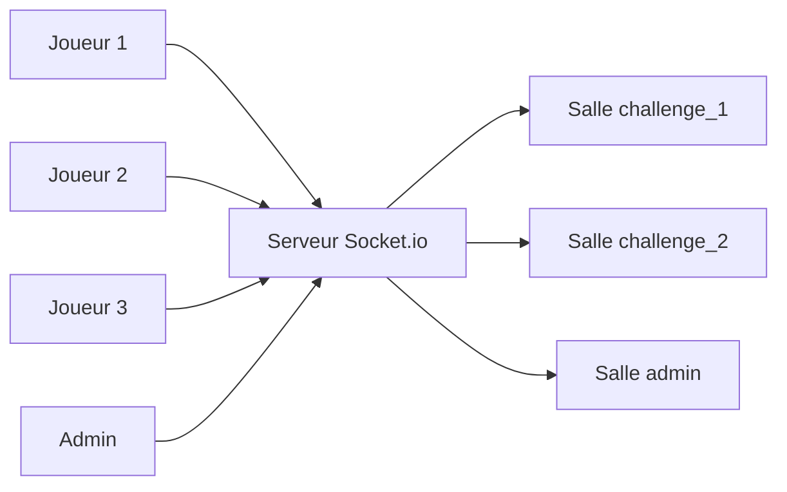

# Événements temps réel

The Box utilise Socket.io pour les classements en direct et le suivi de progression des tâches admin. Document destiné aux développeurs frontend et backend.

## Vue d'ensemble



Chaque défi a sa propre salle. Un changement de score est diffusé à tous les joueurs présents dans la salle correspondante. Les administrateurs reçoivent les mises à jour de progression des tâches en arrière-plan.

## Configuration

### Backend

> **Détail technique.** Initialisation dans `packages/backend/src/infrastructure/socket/socket.ts`.

```typescript
import { Server } from 'socket.io'

export function initializeSocket(httpServer) {
  const io = new Server(httpServer, {
    cors: { origin: env.CORS_ORIGIN, methods: ['GET', 'POST'] },
  })
  io.on('connection', (socket) => {
    // Gestion des événements
  })
  return io
}
```

### Frontend

```typescript
import { io } from 'socket.io-client'

const socket = io(import.meta.env.VITE_API_URL, { autoConnect: false })

socket.connect()    // À l'entrée d'un défi
socket.disconnect() // À la sortie
```

## Événements joueur

### Du client vers le serveur

| Événement | Description |
|-----------|-------------|
| `join_challenge` | Rejoint la salle d'un défi pour recevoir les mises à jour |
| `score_update` | Diffuse le score courant aux autres joueurs |
| `player_finished` | Notifie la fin d'un palier ou du défi |

```typescript
socket.emit('join_challenge', { challengeId: 1, username: 'Player1' })
socket.emit('score_update', { challengeId: 1, score: 500 })
socket.emit('player_finished', { challengeId: 1, score: 3600, tier: 1 })
```

### Du serveur vers le client

| Événement | Description |
|-----------|-------------|
| `player_joined` | Un autre joueur a rejoint la salle |
| `player_left` | Un joueur s'est déconnecté |
| `leaderboard_update` | Le classement en direct a changé |
| `player_finished` | Un autre joueur a terminé un palier |

> **Détail technique.** Charges utiles :

```typescript
// player_joined / player_left
{ username: string, totalPlayers: number }

// leaderboard_update
Array<{ username: string, score: number }>

// player_finished
{ username: string, score: number, tier: number }
```

## Événements admin

Les administrateurs peuvent suivre la progression des tâches en arrière-plan.

### Du client vers le serveur

| Événement | Description |
|-----------|-------------|
| `join_admin` | Rejoint la salle admin |
| `leave_admin` | Quitte la salle admin |

### Du serveur vers le client

| Événement | Description | Charge utile |
|-----------|-------------|--------------|
| `job_progress` | Avancement d'une tâche | `{ jobId, progress (0-100), message }` |
| `job_completed` | Tâche terminée avec succès | `{ jobId, result }` |
| `job_failed` | Tâche échouée | `{ jobId, error }` |

```typescript
socket.on('job_progress', (data) => {
  console.log(`Job ${data.jobId}: ${data.progress}% - ${data.message}`)
})
socket.on('job_completed', (data) => console.log('OK', data.result))
socket.on('job_failed', (data) => console.error('KO', data.error))
```

## Événements GeoGamers (namespace `/geo`)

| Événement | Description | Charge utile |
|-----------|-------------|--------------|
| `geogamers:season:updated` | Diffusion des classements de saison finalisés / mis à jour (top 10) | `{ month: 'YYYY-MM', topN: GeoGamersSeasonStanding[] }` |

Émis par le worker de clôture de saison (`geogamers-season-payout`). Non ciblé
par utilisateur — tout client sur le namespace `/geo` le reçoit et peut
rafraîchir un classement ouvert.

## Gestion des salles

> **Détail technique.** Les joueurs sont placés dans une salle nommée `challenge_<id>`. Les admins dans la salle `admin`.

```typescript
socket.join(`challenge_${challengeId}`)
io.to(`challenge_${challengeId}`).emit('leaderboard_update', entries)
socket.to(`challenge_${challengeId}`).emit('player_joined', data) // exclut l'émetteur
```

## Composant de classement en direct

```typescript
function LiveLeaderboard({ challengeId }) {
  const [entries, setEntries] = useState([])

  useEffect(() => {
    socket.emit('join_challenge', { challengeId, username: currentUser.displayName })
    socket.on('leaderboard_update', setEntries)
    return () => socket.off('leaderboard_update')
  }, [challengeId])

  return (
    <ul>
      {entries.map((e, i) => (
        <li key={i}>#{i + 1} {e.username} : {e.score}</li>
      ))}
    </ul>
  )
}
```

## Diffusion automatique des scores

Le store de jeu diffuse les scores à chaque bonne réponse :

```typescript
submitGuess: async (guess) => {
  const result = await api.submitGuess(guess)
  if (result.isCorrect) {
    set({ totalScore: result.totalScore })
    socket.emit('score_update', { challengeId: get().challengeId, score: result.totalScore })
  }
}
```

## Reconnexion

Socket.io tente la reconnexion automatique. Côté client, il faut rejoindre la salle au retour :

```typescript
socket.on('connect', () => {
  if (currentChallengeId) {
    socket.emit('join_challenge', {
      challengeId: currentChallengeId,
      username: currentUser.displayName,
    })
  }
})
```

## États de connexion

| Événement | Quand |
|-----------|-------|
| `connect` | Connexion établie |
| `disconnect` | Connexion perdue |
| `connect_error` | Échec de connexion |
