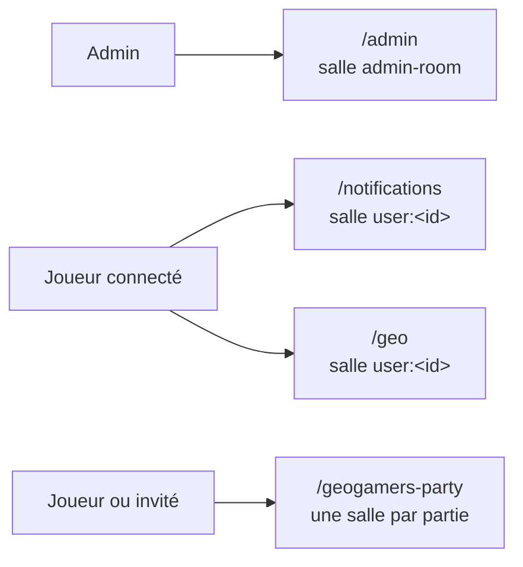

# Événements temps réel

Référence des événements Socket.io de The Box, pour les développeurs frontend et backend.

Le classement du jeu quotidien n'est **pas** poussé en temps réel : la page `/leaderboard` lit l'API REST au chargement. Il n'existe aucun événement de salle de défi (`join_challenge`, `leaderboard_update`, `score_update`, `player_finished`).

Le flux SSE de l'API publique (`GET /api/public/v1/streamers/:slug/live`) n'utilise pas Socket.io. Voir [`public-api.md`](./public-api.md).

## Vue d'ensemble

Un seul serveur Socket.io (chemin `/socket.io`) et quatre namespaces. Le namespace par défaut (`/`) n'est pas utilisé.


```mermaid
graph LR
    A[Admin] --> NA["/admin<br/>salle admin-room"]
    U[Joueur connecté] --> NN["/notifications<br/>salle user:&lt;id&gt;"]
    U --> NG["/geo<br/>salle user:&lt;id&gt;"]
    P[Joueur ou invité] --> NP["/geogamers-party<br/>une salle par partie"]
```

| Namespace | Authentification | Usage |
|-----------|------------------|-------|
| `/admin` | Session Better Auth, rôle `admin` | Progression des tâches d'import et du pipeline Geo |
| `/notifications` | Session Better Auth | Notifications du compte (Premium, récompenses, succès) |
| `/geo` | Session Better Auth | Récompenses des contributions Geo, saisons GeoGamers |
| `/geogamers-party` | Session facultative (invité sinon) | Parties GeoGamers multijoueurs |

> **Détail technique.** Serveur : `packages/backend/src/infrastructure/socket/socket.ts` et `geogamers-party.socket.ts`. Clients : `packages/frontend/src/lib/socket.ts` (`/admin`), `lib/notifications-socket.ts`, `lib/geo-socket.ts`, `stores/geoGamersPartyStore.ts`.

## Connexion côté client

Chaque client ouvre son namespace avec le cookie de session :

```typescript
import { io } from 'socket.io-client'

const base = import.meta.env.VITE_API_URL || ''
const socket = io(`${base}/notifications`, {
  autoConnect: false,
  path: '/socket.io',
  withCredentials: true, // envoie le cookie Better Auth pendant le handshake
  transports: ['websocket', 'polling'],
})
socket.connect()
```

Sans session valide, le middleware du namespace refuse la connexion : `connect_error` avec `unauthorized`, ou `forbidden` sur `/admin` pour un non-admin.

## `/admin`

### Du client vers le serveur

| Événement | Description |
|-----------|-------------|
| `join_admin` | Rejoint la salle `admin-room` |
| `leave_admin` | Quitte la salle `admin-room` |

### Du serveur vers le client (salle `admin-room`)

Tâches de la file d'import BullMQ :

| Événement | Charge utile |
|-----------|--------------|
| `job_added` | `{ jobId }` |
| `job_waiting` | `{ jobId }` |
| `job_active` | `{ jobId }` |
| `job_progress` | `{ jobId, ...data }` (`{ jobId, progress }` quand la progression est un nombre) |
| `job_completed` | `{ jobId, result }` |
| `job_failed` | `{ jobId, error }` |
| `job_delayed` | `{ jobId, delay }` |
| `job_removed` | `{ jobId }` |
| `job_stalled` | `{ jobId }` |

Traitements par lots :

| Événement | Charge utile |
|-----------|--------------|
| `batch_import_progress` | `{ importStateId, progress, status, message?, current, gamesImported, gamesSkipped, screenshotsDownloaded, currentBatch, totalGamesAvailable, totalBatches }` |
| `recalculate_scores_progress` | `{ recalculateStateId, progress, status, message?, sessionsProcessed, sessionsUpdated, sessionsSkipped, totalScoreChanges, currentBatch, totalBatches, dryRun }` |

Pipeline de récupération des cartes Geo :

| Événement | Charge utile |
|-----------|--------------|
| `geo:fetch:started` | `{ totalGames }` |
| `geo:fetch:progress` | `{ gameId, source, stage, outcome? }` |
| `geo:fetch:zoneCandidate` | `{ gameId, zoneSlug, provider, mapId }` |
| `geo:fetch:mapSelected` | `{ gameId, zoneSlug, mapId, by }` |
| `geo:fetch:gameDone` | `{ gameId, mapsFound, zonesTotal, finalStage }` |
| `geo:fetch:done` | `{ succeeded, partial, failed }` |

## `/notifications`

Ce namespace reste connecté sur toutes les pages tant que l'utilisateur est connecté.

### Du client vers le serveur

| Événement | Description |
|-----------|-------------|
| `join_user` | `userId` (chaîne). Rejoint `user:<userId>`. Le serveur ignore un `userId` différent de celui de la session. |

### Du serveur vers le client (salle `user:<id>`)

| Événement | Charge utile | Émis par |
|-----------|--------------|----------|
| `user:premium-granted` | `UserPremiumGrantedEvent` | Attribution de Premium |
| `reward:granted` | `RewardGrantedEvent` | Chaque récompense asynchrone, après `rewardsService.grant` |
| `achievement:unlocked` | `AchievementUnlockedEvent` (`{ userId, achievements, unlockedAt }`) | Fin ou abandon d'une partie quotidienne, partie GeoGamers, worker d'ancienneté du compte |

Ces émissions ne font pas foi. Un client hors ligne retrouve l'état par l'API REST (liste des récompenses non réclamées, page des succès).

## `/geo`

### Du client vers le serveur

| Événement | Description |
|-----------|-------------|
| `join_user` | Même règle que sur `/notifications` |

### Du serveur vers le client

| Événement | Destinataires | Charge utile |
|-----------|---------------|--------------|
| `geo:contribution:rewarded` | `user:<id>` | `GeoRewardedEvent` |
| `geo:contributor:tier_up` | `user:<id>` | `GeoTierUpEvent` |
| `geogamers:season:updated` | Tout le namespace | `{ month: 'YYYY-MM', topN: GeoGamersSeasonStanding[] }` |

Le worker de clôture de saison (`geogamers-season-payout`) émet `geogamers:season:updated`. Un client qui affiche le classement de saison peut alors le rafraîchir.

## `/geogamers-party`

Un utilisateur sans session joue comme invité (`guest_<socketId>`, nom « Invité »). Tous les événements client portent le `code` de la partie, sauf `party:create`.

### Du client vers le serveur

| Événement | Charge utile |
|-----------|--------------|
| `party:create` | `{ rounds?, timerSeconds?, name? }` |
| `party:join` | `{ code, name? }` |
| `party:start` | `{ code }` (hôte seulement) |
| `party:guess_game` | `{ code, guess }` |
| `party:guess_location` | `{ code, geoMapId, guess }` |
| `party:force_reveal` | `{ code }` (hôte seulement) |
| `party:advance` | `{ code }` (hôte seulement, pendant la révélation) |
| `party:leave` | `{ code }` |

### Du serveur vers le client

| Événement | Charge utile |
|-----------|--------------|
| `party:identity` | `{ playerId }`, à la connexion |
| `party:created` | `{ code }` |
| `party:state` | `GeoGamersPartyView`, envoyé à chaque joueur après chaque changement |
| `party:guess_result` | `{ correct }` |
| `party:error` | `{ code, message }` (`NOT_FOUND`, `LOBBY_FULL`, `NOT_HOST`, `NOT_ENOUGH_CONTENT`, …) |

## Reconnexion

Les clients se reconnectent automatiquement (`reconnectionAttempts: Infinity`). Le serveur oublie les salles d'un socket déconnecté. Les clients `/notifications` et `/geo` réémettent `join_user` à chaque `connect`. Le client `/admin` n'émet `join_admin` qu'à la première connexion (`once('connect')`) : après une reconnexion, il ne reçoit plus les événements de `admin-room` jusqu'au prochain appel de `connectAdminSocket()`.
